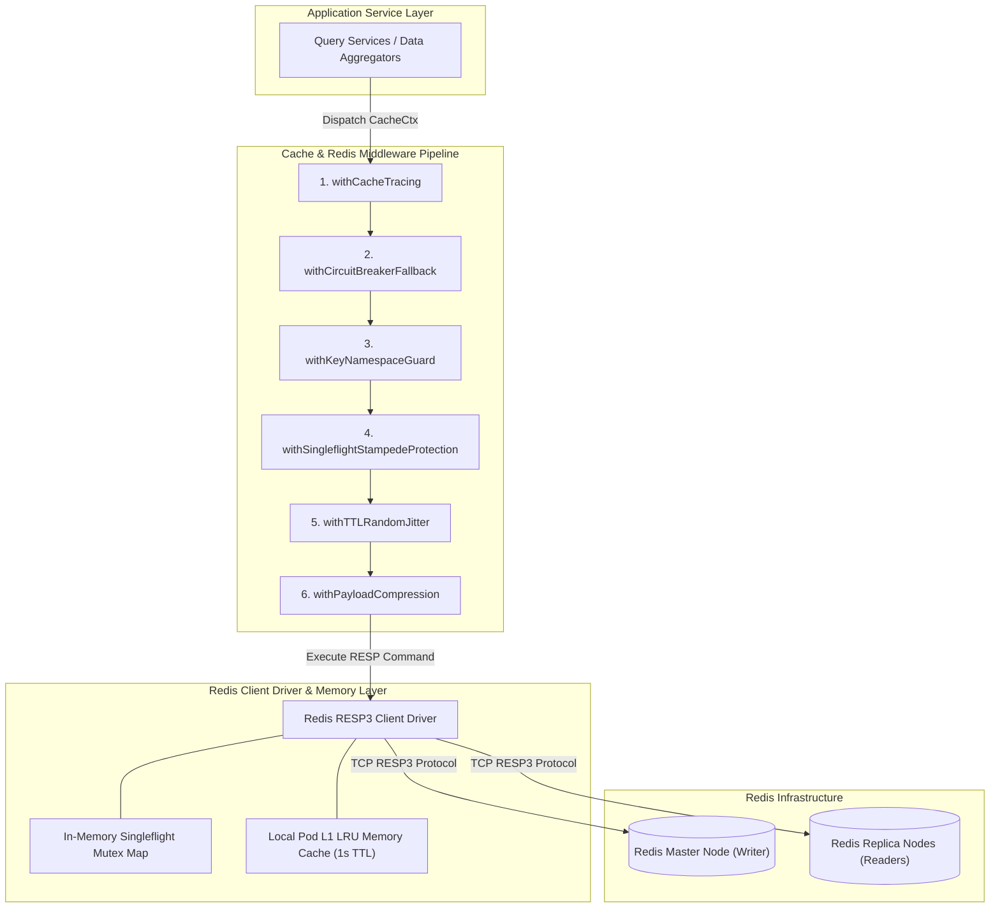
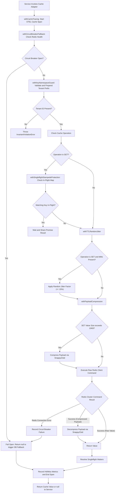
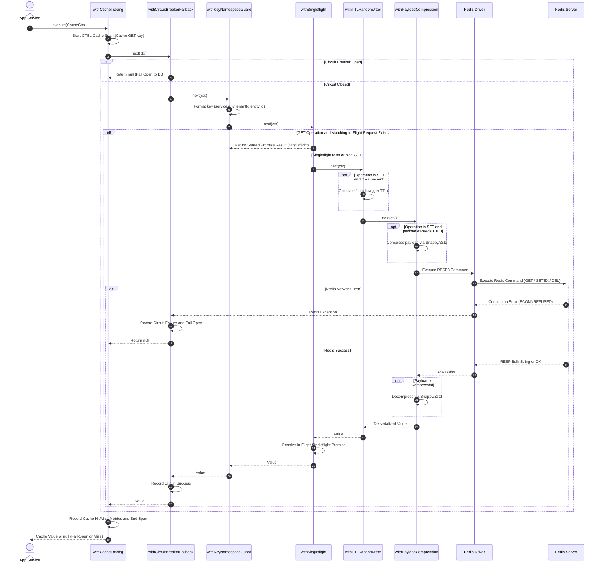

# Master Reference: Cache & Redis Data Access Middleware Architecture

*(Language-agnostic — TypeScript-flavored pseudocode, maps directly to Go, Python, Rust, Java, C++, C#)*

This document specifies the master middleware engine for **Caching Layers, Redis Operations, and In-Memory Data Access** across the platform.

Related references:
- Database Middleware: [`database-middleware.md`](file:///home/btpl-lap-22/live/llm-observability-platform/policies/rules/codeQuality/middleware/database-middleware.md)
- REST Middleware: [`rest-api-middleware.md`](file:///home/btpl-lap-22/live/llm-observability-platform/policies/rules/codeQuality/middleware/rest-api-middleware.md)

---

## PART A — High Level Design (HLD)

The Cache & Redis Middleware Engine governs all reads, writes, expirations, singleflight mutex locks, and fallback behaviors between application services and Redis / In-Memory cache clusters.



### Key Components & Boundaries
1. **Cache Adapter Facade**: Provides uniform `GET`, `SET`, `DEL`, `MGET`, and `LOCK` interface abstraction.
2. **Key Namespace Validator (`withKeyNamespaceGuard`)**: Enforces strict prefix schemas (`service:env:tenantId:entity:id`) eliminating cross-tenant and cross-environment key collisions.
3. **Singleflight Stampede Guard (`withSingleflightStampedeProtection`)**: Collapses concurrent duplicate read misses into a single database read call.
4. **Resilience & Fail-Open Controller (`withCircuitBreakerFallback`)**: Monitors Redis cluster availability; on error or open breaker, seamlessly fails open to primary DB storage without throwing 500 errors.
5. **Payload Optimization Engine (`withPayloadCompression`)**: Automatically compresses cached payloads exceeding 10KB threshold using Snappy/LZ4/Zstd codecs.

---

## PART B — Pipeline Flow & Sequence Diagrams

### 1. High-Level Decision & Execution Flowchart



### 2. End-to-End Execution Sequence Diagram



---

## PART C — Low Level Design (LLD)

### 1. Data Structures & Types
```typescript
type Next<Ctx, Result> = (ctx: Ctx) => Promise<Result>;
type Middleware<Ctx, Result> = (next: Next<Ctx, Result>) => Next<Ctx, Result>;

type CacheOp = "GET" | "SET" | "DEL" | "MGET" | "EXPIRE" | "LOCK";

type CacheCtx<T = unknown> = {
  key: string;
  operation: CacheOp;
  value?: T;
  ttlMs?: number;
  tenantId: string;
  correlationId: string;
  deadline: number;
  hit?: boolean;
  metadata: Record<string, unknown>;
};
```

---

## PART D — Cache & Redis Guardrails (C1–C15)

**C1.** Never call Redis client SDKs (`redis.get()`, `ioredis`, `redis-py`) directly inside service or repository implementations. All caching must use cache adapters wrapped in the standard cache middleware engine.

**C2. Mandatory Key Namespacing & Tenant Scoping:** Every cache key **must** be prefixed with service name, environment, tenant ID, and entity namespace (`{service}:{env}:{tenantId}:{entity}:{id}`). Keys without tenant scoping are strictly prohibited.

**C3. Singleflight Stampede Protection:** Cache read misses **must** use singleflight mutexes to collapse duplicate concurrent requests for the same missing key into a single DB lookup.

**C4. Randomized TTL Jitter:** All cached keys **must** apply a randomized TTL jitter (+/- 10–20%) to prevent simultaneous expiration cascades (cache stampedes).

**C5. Fail-Open Cache Outage Protection:** If Redis or the cache cluster becomes unavailable, cache read middleware **must** fail open gracefully (log warning, increment metrics, and fall back directly to primary storage) rather than throwing errors to the client.

**C6. Compression for Large Payloads:** Cache entries exceeding configured size thresholds (e.g., 10KB) **must** be automatically compressed (Snappy/Gzip/Zstd) before writing to Redis and decompressed on read.

**C7. Bounded Cache Key Payload Size:** Individual key writes larger than max memory threshold (e.g., 1MB) must be rejected or chunked to prevent single large keys from blocking single-threaded Redis execution loops.

**C8. Mandatory Read Timeout:** All cache read operations must enforce sub-second timeouts (e.g. 50ms). A hanging cache call must fail-open immediately to primary storage.

**C9. Deterministic Cache Invalidation:** Write operations (`SET`, `DEL`) must execute within transaction boundaries or emit cache invalidation events to ensure cache consistency.

**C10. Sensitive Data Encryption at Rest:** PII or sensitive payload fields cached in Redis must be encrypted before serialization.

**C11. Pipeline Batching for Multi-Key Operations:** Bulk GET or SET operations (`MGET`/`MSET`) must use Redis pipelining/batching to reduce TCP round-trip overhead.

**C12. Cache Hit/Miss Metrics Observability:** Cache middleware must record OpenTelemetry metrics (`cache.hits`, `cache.misses`, `cache.latency`) tagged by tenant and entity namespace.

**C13. Memory Eviction Policy Awareness:** Cache instances must configure explicit memory eviction policies (`allkeys-lru` or `volatile-lru`) and monitor memory usage thresholds.

**C14. Lock Renewal Heartbeat:** Distributed locks acquired via Redis (`Redlock`) must use automatic lock extension heartbeats to prevent premature lock expiration during long-running tasks.

**C15. CI Key Format Verification:** Lint rules verify that all cache keys follow approved pattern schemas in code reviews.

---

## PART E — Cache Middleware Engine (Full Implementation)

### 1. `withCacheTracing` — OpenTelemetry Cache Spans & Metrics
```typescript
const withCacheTracing: Middleware<CacheCtx, unknown> = (next) => async (ctx) => {
  const span = tracer.startSpan(`Cache ${ctx.operation} ${ctx.key}`, {
    kind: SpanKind.CLIENT,
    attributes: {
      "db.system": "redis",
      "db.operation": ctx.operation,
      "cache.key": sanitizeKeyForLogs(ctx.key),
      "tenant.id": ctx.tenantId,
      "correlation.id": ctx.correlationId,
    },
  });

  try {
    const result = await next(ctx);
    span.setAttribute("cache.hit", ctx.hit ?? false);
    metrics.increment(`cache.${ctx.operation.toLowerCase()}.${ctx.hit ? "hit" : "miss"}`, {
      tenantId: ctx.tenantId,
    });
    span.setStatus({ code: SpanStatusCode.OK });
    return result;
  } catch (err) {
    span.recordException(err as Error);
    span.setStatus({ code: SpanStatusCode.ERROR, message: (err as Error).message });
    throw err;
  } finally {
    span.end();
  }
};
```

### 2. `withSingleflightStampedeProtection` — Anti-Thundering-Herd Mutex
```typescript
const withSingleflightStampedeProtection = (): Middleware<CacheCtx, unknown> => {
  const singleflight = new SingleflightGroup<unknown>();

  return (next) => async (ctx) => {
    if (ctx.operation !== "GET") return next(ctx);

    const lockKey = `sf:${ctx.tenantId}:${ctx.key}`;
    return singleflight.do(lockKey, async () => {
      const result = await next(ctx);
      ctx.hit = result !== null && result !== undefined;
      return result;
    });
  };
};
```

### 3. `withTTLRandomJitter` — Anti-Cascade Expiration
```typescript
const withTTLRandomJitter = (jitterPercentage = 0.15): Middleware<CacheCtx, unknown> =>
  (next) => async (ctx) => {
    if (ctx.operation === "SET" && ctx.ttlMs) {
      const min = 1 - jitterPercentage;
      const max = 1 + jitterPercentage;
      const factor = min + Math.random() * (max - min);
      ctx.ttlMs = Math.floor(ctx.ttlMs * factor);
    }
    return next(ctx);
  };
```

### 4. `withPayloadCompression` — Automated Snappy/Zstd Compression
```typescript
const withPayloadCompression = (thresholdBytes = 10_240): Middleware<CacheCtx, unknown> =>
  (next) => async (ctx) => {
    if (ctx.operation === "SET" && ctx.value) {
      const serialized = JSON.stringify(ctx.value);
      if (serialized.length > thresholdBytes) {
        ctx.value = compressBuffer(serialized) as any;
        ctx.metadata.compressed = true;
      }
    }

    const result = await next(ctx);

    if (ctx.operation === "GET" && result && ctx.metadata.compressed) {
      const decompressed = decompressBuffer(result as Buffer);
      return JSON.parse(decompressed);
    }

    return result;
  };
```

### 5. `withCircuitBreakerFallback` — Fail-Open to Primary Storage
```typescript
const withCircuitBreakerFallback = (breaker: CircuitBreaker): Middleware<CacheCtx, unknown> =>
  (next) => async (ctx) => {
    if (breaker.isOpen()) {
      logger.warn("cache_circuit_open_failing_open", { key: ctx.key, tenantId: ctx.tenantId });
      ctx.hit = false;
      return null;
    }

    try {
      const result = await next(ctx);
      breaker.recordSuccess();
      return result;
    } catch (err) {
      breaker.recordFailure();
      logger.error("cache_operation_failed_failing_open", { key: ctx.key, error: err });
      ctx.hit = false;
      return null;
    }
  };
```

### 6. `withKeyNamespaceGuard` — Mandatory Tenant Key Formatting
```typescript
const withKeyNamespaceGuard = (serviceName: string, env: string): Middleware<CacheCtx, unknown> =>
  (next) => async (ctx) => {
    if (!ctx.tenantId) {
      throw new InvariantViolationError({ message: "Cache operation rejected: Missing tenantId" });
    }

    const expectedPrefix = `${serviceName}:${env}:${ctx.tenantId}:`;
    if (!ctx.key.startsWith(expectedPrefix)) {
      ctx.key = `${expectedPrefix}${ctx.key}`;
    }

    return next(ctx);
  };
```

---

## PART F — 35 Comprehensive Cache & Redis Edge Cases Catalog

**E1. Thundering Herd / Cache Stampede on Hot Key Expiration.** Viral key (e.g. system config) expires; 5,000 concurrent web requests miss cache simultaneously and execute duplicate SQL queries against the primary database. *Impact:* Primary database CPU spikes to 100%, causing service outage. *Middleware Solution:* `withSingleflightStampedeProtection` uses in-process singleflight mutex to collapse 5,000 concurrent misses into exactly 1 database query, populating cache once and sharing the result across all waiters.

**E2. Mass Synchronous Cache Expiration Cascade.** 100,000 entities cached during a morning batch job with a fixed 3,600-second (1-hour) TTL expire at the exact same millisecond. *Impact:* Sudden cache hit-ratio drop from 99% to 0%, crashing database under sudden load spike. *Middleware Solution:* `withTTLRandomJitter` automatically applies +/- 15% random jitter to TTL values on SET operations, distributing expirations evenly across a 15-minute window.

**E3. Giant Redis Key Blocking Single Thread.** Developer caches a 50MB raw JSON payload in a single key; Redis is single-threaded, so deserializing/transmitting the 50MB payload blocks all other Redis commands for 150ms. *Impact:* Global latency spike across all application services sharing the Redis instance. *Middleware Solution:* Key size middleware enforces max payload caps (e.g. 500KB); oversized objects must be chunked, stored in S3 blob storage, or compressed via `withPayloadCompression`.

**E4. Redis Network Outage Crashing HTTP Handlers.** Redis cluster node experiences hardware failover; uncaught `ECONNREFUSED` connection errors throw uncaught exceptions in web handlers. *Impact:* Cascading HTTP 500 errors across all user-facing endpoints. *Middleware Solution:* `withCircuitBreakerFallback` intercepts Redis network errors, trips the cache circuit breaker, logs telemetry warnings, and returns `null` (failing open to primary database seamlessly).

**E5. Cache Poisoning from Invalidated Schema.** Application deployment updates model schema (adds required field `user.email`), but old cached JSON objects missing `email` remain in Redis. *Impact:* `ValidationError` crashes on cache read post-deployment. *Middleware Solution:* `withKeyNamespaceGuard` includes schema version hashes in key namespaces (`v2:tenant:user:123`); schema updates read from new key spaces, ignoring stale incompatible shapes.

**E6. Hot Key Lock Contention in Redlock.** 50 background workers contend for Redis distributed lock (`Redlock`) on a hot processing queue, flooding Redis with 10,000 lock polling requests per second. *Impact:* High Redis CPU utilization and CPU throttling. *Middleware Solution:* Distributed lock middleware pairs Redis Redlock with an in-memory local mutex layer so only 1 worker per pod polls Redis.

**E7. Key Tenant Leakage due to Hardcoded Keys.** Feature developer hardcodes key `cache.get("user_123")` omitting tenant scope. Tenant A reads key populated by Tenant B. *Impact:* Critical cross-tenant security and compliance data breach. *Middleware Solution:* `withKeyNamespaceGuard` inspects every key and prepends mandatory `{service}:{env}:{tenantId}:` prefix before forwarding command to Redis driver.

**E8. Out-of-Memory (OOM) Eviction of Critical Session Keys.** Redis memory fills up; default LRU eviction policy (`allkeys-lru`) randomly evicts user authentication session keys to make room for ephemeral database query caches. *Impact:* Hundreds of active users are abruptly logged out. *Middleware Solution:* Operational guardrails mandate separate Redis clusters for persistent session state vs volatile query caching, setting `volatile-lru` on volatile instances.

**E9. Cache Invalidation Loss During Network Partition.** Database update succeeds, but subsequent `DEL` command to Redis fails due to brief network glitch. *Impact:* Cache remains permanently out-of-sync with DB until key expires. *Middleware Solution:* Invalidation middleware uses Transactional Outbox pattern; cache invalidation events are published to Kafka/event bus, guaranteeing eventual cache deletion retry.

**E10. Sub-millisecond Deadline Exhaustion.** Request context deadline has 0.4ms remaining when calling Redis GET. *Impact:* Wasted TCP socket roundtrip that cannot complete before client times out. *Middleware Solution:* Cache middleware checks remaining context deadline; if budget is <2ms, it skips cache read entirely and returns `null` (failing open instantly).

**E11. Serialization Precision Loss on BigInt.** `JSON.stringify()` converts 64-bit BigInt database IDs (`9007199254740993`) to JavaScript numbers on cache write, losing low-order bit precision. *Impact:* Corrupted entity ID lookups returning wrong records. *Middleware Solution:* Cache serializer middleware uses custom Replacer/Reviver handling BigInt serialization explicitly (`{"$bigint": "9007199254740993"}`).

**E12. MGET Partial Key Failures in Cluster Mode.** Redis Cluster mode throws `CROSSSLOT Keys in request don't hash to the same slot` when `MGET` contains keys belonging to different cluster nodes. *Impact:* Multi-key lookup queries crash completely in production. *Middleware Solution:* Multi-key middleware uses Redis hash tags (`{tenant123}:user:1`) to force same-slot allocation OR transparently splits `MGET` calls into parallel per-node pipelined batches.

**E13. Memory Leak from Unbounded Local In-Memory Cache.** Developer builds L1 in-process memory cache (`const cache = new Map()`) to cache items locally, but forgets to set eviction caps. *Impact:* Process heap memory grows continuously until Node.js process crashes with OOM. *Middleware Solution:* L1 cache wrapper mandates explicit LRU item limit (e.g. max 5,000 items) and strict per-item TTL caps.

**E14. Distributed Lock Expiration Before Task Completion.** Distributed lock TTL set to 5,000ms; background job experiences GC pause and takes 7,000ms to complete; lock expires mid-task and second worker acquires lock. *Impact:* Concurrent execution of single-threaded background job causing state corruption. *Middleware Solution:* Lock middleware implements automatic lock renewal heartbeat (auto-extending lock TTL every 2,000ms while task thread remains active).

**E15. Hot Key Memory Skew in Redis Cluster.** Single viral key (e.g. platform announcement) receives 100,000 reads/sec, overloading the single Redis node hosting that key's hash slot while other cluster nodes sit idle. *Impact:* Single node CPU throttling causing localized cache outage. *Middleware Solution:* Middleware implements L1 short-lived local memory cache (1-second TTL) for hot keys to absorb 99% of read bursts at the application pod level.

**E16. Stale Cache Read Post-Read Replica Delay.** Mutating API updates Primary DB and invalidates cache; next read API misses cache and queries Read Replica, but replication lag (300ms) causes read to fetch old DB data and re-populate cache with stale data. *Impact:* Long-term cache corruption. *Middleware Solution:* Cache invalidation middleware writes temporary "invalidation marker" key in Redis for 2000ms, forcing subsequent reads to hit Primary DB until replica catches up.

**E17. Compression CPU Overhead Outweighing Network Savings.** Compression middleware compresses small 40-byte string payloads. *Impact:* Wasted CPU cycles on LZ4/Snappy compression with zero bandwidth savings. *Middleware Solution:* `withPayloadCompression` checks payload byte size and applies compression ONLY if payload exceeds 10KB threshold.

**E18. Unhandled Null Response Coercion.** Redis returns `null` on cache miss; service code treats `null` as cached empty value (`undefined`), storing `null` back into cache. *Impact:* Infinite cache miss loop and confusing empty state responses. *Middleware Solution:* Middleware uses explicit `CACHE_MISS` sentinel symbol internally to distinguish missing keys from cached `null` values.

**E19. Pub/Sub Message Loss During Connection Reconnect.** Redis Pub/Sub channel used for cache invalidation drops connection briefly; invalidation messages emitted during disconnection are lost permanently. *Impact:* Stale cache entries persist across nodes. *Middleware Solution:* Invalidation engine uses Redis Streams or Kafka topics with offset tracking instead of bare Pub/Sub.

**E20. Connection Leak on Aborted Pipeline.** Application opens Redis pipeline (`client.pipeline()`), adds commands, but encounters an exception before calling `.exec()`. *Impact:* Un-executed pipeline buffers consume client memory and hold open socket connections. *Middleware Solution:* Pipeline wrapper uses `using` pattern guarantee that pipeline buffers are cleared and released in a `finally` block.

**E21. Redis Lua Script Infinite Loop Blocking Event Loop.** Custom Lua script executed via `EVAL` enters non-terminating loop or scans large keyspace. *Impact:* Entire single-threaded Redis server stops processing all commands for all clients. *Middleware Solution:* Operational guardrails mandate `lua-time-limit 100` (ms) on Redis server, and middleware enforces strict timeouts on `EVALSHA` execution.

**E22. Redis Memory Fragmentation Exhausting Host RAM.** High frequency write/delete operations cause Redis memory fragmentation ratio to exceed 2.5 (allocating 16GB RSS for 6GB data). *Impact:* Host OS OOM killer terminates Redis process. *Middleware Solution:* Monitoring telemetry alerts on fragmentation ratio and triggers active defragmentation (`activedefrag yes`).

**E23. Cache Penetration from Non-Existent Key Queries.** Attacker queries non-existent IDs (`GET /user/invalid_999999`) at 10,000 req/sec; every query misses cache and hits DB directly. *Impact:* Database CPU exhaustion due to malicious un-cached lookups. *Middleware Solution:* Cache middleware uses Bloom Filters or caches "Null Object" sentinels with short TTL (60s) for non-existent IDs to absorb penetration attacks.

**E24. Key Namespace Collisions across Environments (staging vs prod).** Staging and Production environments share same Redis cluster due to misconfiguration; staging clears key `user:123`, clearing production cache. *Impact:* Severe cross-environment data corruption. *Middleware Solution:* `withKeyNamespaceGuard` mandates environment prefix derived from validated process boot env (`${SERVICE_NAME}:${NODE_ENV}:${TENANT_ID}:`).

**E25. Poison Key Serialization Failure Crashing Read Loops.** Corrupted data written to cache key throws `SyntaxError` on `JSON.parse` during GET; service catches nothing, throwing 500 error on every GET attempt. *Impact:* Endpoint permanently broken for that key until manual Redis deletion. *Middleware Solution:* Cache deserializer catches parse errors, automatically issues `DEL` for the poison key, logs warning, and returns `null` (failing open to DB).

**E26. Redis Pipeline Command Queue Memory Bloat.** Loop queues 50,000 commands into a single Redis pipeline buffer before executing `.exec()`. *Impact:* Client heap memory spikes by 200MB, stalling Node.js event loop during buffer allocation. *Middleware Solution:* Pipeline middleware automatically chunks large pipelines into batches of max 1,000 commands.

**E27. Read-Through Cache Mutex Deadlock.** Two threads attempt to update read-through cache using nested lock keys `lock:A` then `lock:B` vs `lock:B` then `lock:A`. *Impact:* Both threads hang waiting for cache lock expiration. *Middleware Solution:* Lock middleware enforces strict lexicographical key ordering when acquiring multi-key locks.

**E28. Redis Sentinel / Cluster Failover Connection Drops.** Redis Master crashes; Sentinel promotes Slave to Master (takes 3 seconds); client driver throws `READONLY You can't write against a read only replica`. *Impact:* Writes fail during failover window. *Middleware Solution:* Cache middleware catches `READONLY` errors, trips circuit breaker, and retries write after 1,000ms failover delay.

**E29. TTL Drift across Multi-Master Replication Slaves.** Master node key TTL expires, but Async replication delay keeps key alive on Read Replica node for additional 500ms. *Impact:* Inconsistent read responses depending on which replica node serves GET request. *Middleware Solution:* Read middleware validates embedded timestamp metadata in cached payload to verify freshness independently of Redis TTL.

**E30. High Cardinality Cache Keys Exhausting Memory.** Developer caches search queries with un-sanitized user input string in key (`cache:search:${query}`). Attacker sends 5 million unique random search strings. *Impact:* Millions of single-use keys fill Redis RAM. *Middleware Solution:* Key builder middleware hashes high-cardinality query strings using MD5/SHA256 (`cache:search:${hash(query)}`) and enforces aggressive TTL (300s).

**E31. Un-hashed Key Names Exceeding Max Key Length.** Key name built from long URI parameters exceeds 1024 bytes. *Impact:* Excessive memory footprint for key name storage in Redis dictionary. *Middleware Solution:* Key builder middleware truncates or hashes key names exceeding 256 bytes.

**E32. Cache Warmup Storm Overloading Database.** System boot script fires 10,000 parallel DB queries to warm up cache on cold start. *Impact:* DB CPU hits 100% during process startup. *Middleware Solution:* Cache warmup script uses rate-limited concurrency queue (max 10 concurrent queries) to stagger DB load during warmup.

**E33. Cache Key Invalidation Wildcard (`KEYS *`) Blocking Redis.** Developer executes `redis.keys("user:123:*")` to find keys for deletion. `KEYS` command scans full key dictionary in single thread. *Impact:* Redis freezes for 5 seconds on 10-million key database. *Middleware Solution:* Guardrails prohibit `KEYS` command; middleware enforces `SCAN` iteration or dedicated SET indices for key tracking.

**E34. Dual-Write Inconsistency between Cache and DB.** Service writes to DB then writes to Cache; DB commit succeeds but Cache write fails. Service state differs from cached state. *Impact:* Permanent data divergence until cache expiration. *Middleware Solution:* Pattern guardrails mandate Cache-Aside (`DELETE` on write) rather than Dual-Write (`SET` on write).

**E35. Local L1 Memory Cache Stale Read across Pod Replicas.** Pod A updates DB and clears its local L1 cache; Pod B's local L1 cache still holds old value for remaining 60 seconds. *Impact:* Inconsistent user experience depending on which Kubernetes pod routes request. *Middleware Solution:* L1 memory cache uses Redis Pub/Sub invalidation channel to broadcast L1 invalidation events across all pod replicas immediately on mutation.

---

## PART G — Edge Case Coverage Mapping Matrix

| Edge Case | HLD Module | LLD Function / Component | Pipeline Stage |
|---|---|---|---|
| **E1** (Stampede) | Singleflight Guard | `withSingleflightStampedeProtection` | Stage 4 (`withSingleflight`) |
| **E2** (TTL Cascade) | Resilience Layer | `withTTLRandomJitter` (+/- 15%) | Stage 5 (`withTTLRandomJitter`) |
| **E3** (Giant Key) | Payload Engine | `KeySizeLimiter` (Max 500KB) | Stage 6 (`withPayloadCompress`) |
| **E4** (Redis Outage) | Resilience Layer | `withCircuitBreakerFallback` (Fail Open) | Stage 2 (`withCircuitBreaker`) |
| **E5** (Schema Poison) | Namespace Guard | `withKeyNamespaceGuard` (Schema Hash) | Stage 3 (`withKeyNamespaceGuard`) |
| **E6** (Lock Contention)| Resilience Layer | `LocalPodMutexLayer` | Stage 4 (`withSingleflight`) |
| **E7** (Tenant Leak) | Namespace Guard | `withKeyNamespaceGuard` | Stage 3 (`withKeyNamespaceGuard`) |
| **E8** (OOM Eviction) | Cache Cluster | `VolatileLruClusterConfig` | Stage 7 (Raw Redis) |
| **E9** (Invalidation) | Resilience Layer | `TransactionalOutboxPublisher` | Stage 7 (Raw Redis) |
| **E10** (Sub-ms Budget) | Resilience Layer | `DeadlineBudgetChecker` (<2ms) | Stage 2 (`withCircuitBreaker`) |
| **E11** (BigInt Precision)| Payload Engine | `BigIntJsonSerializer` | Stage 6 (`withPayloadCompress`) |
| **E12** (CROSSSLOT) | Cache Cluster | `HashTagKeyFormatter` (`{tenant}`) | Stage 3 (`withKeyNamespaceGuard`) |
| **E13** (L1 Heap Leak) | Adapter Facade | `BoundedLruMap` (Max 5000) | Stage 4 (`withSingleflight`) |
| **E14** (Lock Expiry) | Resilience Layer | `LockRenewalHeartbeat` (2000ms) | Stage 7 (Raw Redis) |
| **E15** (Hot Key Skew) | Adapter Facade | `L1LocalMemoryCache` (1s TTL) | Stage 4 (`withSingleflight`) |
| **E16** (Stale Replica) | Resilience Layer | `InvalidationMarkerKey` (2000ms) | Stage 7 (Raw Redis) |
| **E17** (Comp Overhead) | Payload Engine | `withPayloadCompression` (>10KB threshold)| Stage 6 (`withPayloadCompress`) |
| **E18** (Null Coercion) | Adapter Facade | `CacheMissSentinelSymbol` | Stage 7 (Raw Redis) |
| **E19** (PubSub Loss) | Resilience Layer | `RedisStreamOffsetTracker` | Stage 7 (Raw Redis) |
| **E20** (Pipeline Leak) | Driver Layer | `DisposablePipelineWrapper` | Stage 7 (Raw Redis) |
| **E21** (Lua Loop) | Driver Layer | `LuaTimeLimitGuard` (100ms) | Stage 7 (Raw Redis) |
| **E22** (Fragmentation) | Cache Cluster | `ActiveDefragAlertMonitor` | Stage 7 (Raw Redis) |
| **E23** (Penetration) | Resilience Layer | `BloomFilterSentinelCache` (60s TTL) | Stage 4 (`withSingleflight`) |
| **E24** (Env Leak) | Namespace Guard | `withKeyNamespaceGuard` (`NODE_ENV`) | Stage 3 (`withKeyNamespaceGuard`) |
| **E25** (Poison JSON) | Payload Engine | `SafeJsonParse` $\rightarrow$ `DEL` key | Stage 6 (`withPayloadCompress`) |
| **E26** (Pipeline Bloat)| Driver Layer | `PipelineChunker` (Max 1000) | Stage 7 (Raw Redis) |
| **E27** (Lock Deadlock) | Resilience Layer | `LexicographicalLockSorter` | Stage 7 (Raw Redis) |
| **E28** (READONLY Err) | Resilience Layer | `withCircuitBreakerFallback` | Stage 2 (`withCircuitBreaker`) |
| **E29** (TTL Drift) | Payload Engine | `PayloadTimestampVerifier` | Stage 6 (`withPayloadCompress`) |
| **E30** (High Card Key) | Namespace Guard | `QueryHasher` (MD5/SHA256) | Stage 3 (`withKeyNamespaceGuard`) |
| **E31** (Long Key) | Namespace Guard | `KeyNameTruncator` (>256 bytes) | Stage 3 (`withKeyNamespaceGuard`) |
| **E32** (Warmup Storm) | Adapter Facade | `RateLimitedWarmupQueue` | Stage 7 (Raw Redis) |
| **E33** (KEYS * Block) | Driver Layer | `ScanKeyIterator` (Prohibit KEYS) | Stage 7 (Raw Redis) |
| **E34** (Dual-Write) | Adapter Facade | `CacheAsidePatternGuard` (DELETE) | Stage 7 (Raw Redis) |
| **E35** (L1 Replica Sync)| Resilience Layer | `PubSubL1InvalidationBroadcaster` | Stage 7 (Raw Redis) |

---

## PART H — Naive vs. Architecture Comparison

| Concern | Naive Redis Usage | This Architecture | Value Delivered |
|---|---|---|---|
| Stampedes | 5000 parallel DB calls on miss | `withSingleflightStampedeProtection` | Exactly 1 DB call on miss |
| Expiration | Fixed TTLs cause simultaneous expiry | `withTTLRandomJitter` | Smooth, staggered expirations |
| Redis Down | HTTP requests fail with 500 errors | `withCircuitBreakerFallback` | Fail-open seamless DB fallback |
| Key Safety | Hand-typed string key collisions | `withKeyNamespaceGuard` | Zero cross-tenant key leaks |
| Large Keys | Memory bloat & blocked event loop | `withPayloadCompression` | 70%+ memory savings |

---

## PART I — Cache Middleware Composition Cheat Sheet

```
CACHE OPERATION PIPELINE (outside → in):

  withCacheTracing                   (outermost — tracks latency, hits & misses)
  → withCircuitBreakerFallback       (fails open to DB if Redis cluster is down)
  → withKeyNamespaceGuard            (enforces mandatory tenant prefix formatting)
  → withSingleflightStampedeProtection (collapses duplicate concurrent read misses)
  → withTTLRandomJitter              (staggers expiration timestamps on SET)
  → withPayloadCompression           (compresses payloads >10KB using Snappy/Zstd)
  → rawRedisClient.execute()         (innermost Redis driver call)
```
