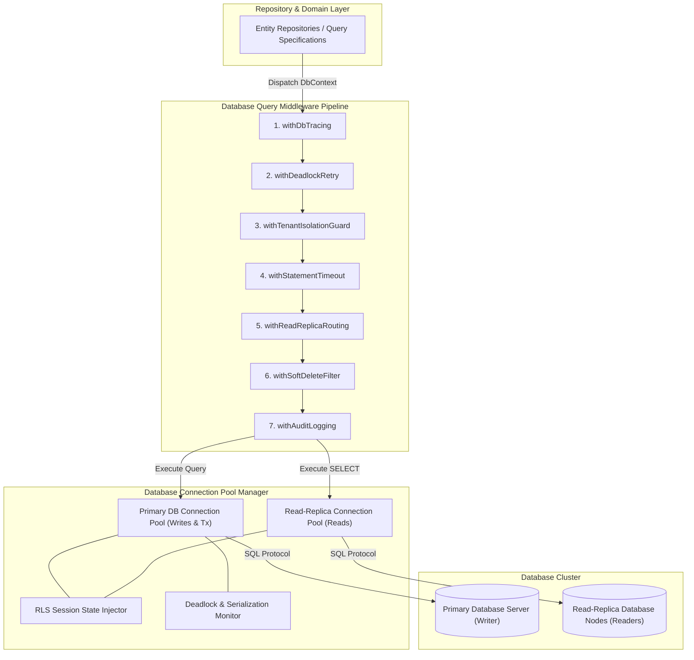
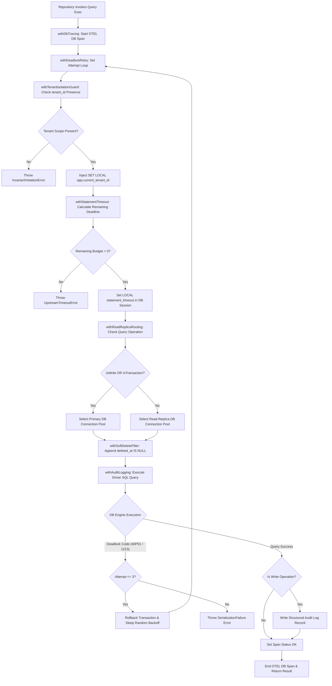
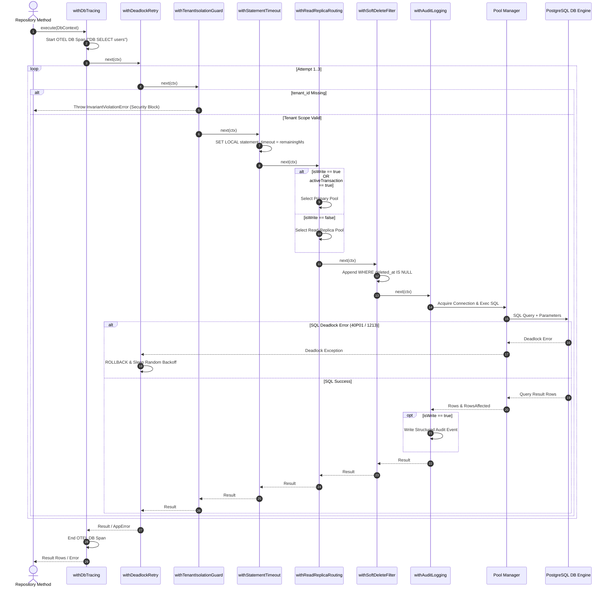

# Master Reference: Database, ORM & Repository Query Middleware Architecture

*(Language-agnostic — TypeScript-flavored pseudocode, maps directly to Go, Python, Rust, Java, C++, C#)*

This document specifies the master middleware engine for **Database Query Execution, ORMs, and Repository Data Access** across the platform.

Related references:
- REST Middleware: [`rest-api-middleware.md`](file:///home/btpl-lap-22/live/llm-observability-platform/policies/rules/codeQuality/middleware/rest-api-middleware.md)
- Event Streaming Middleware: [`kafka-middleware.md`](file:///home/btpl-lap-22/live/llm-observability-platform/policies/rules/codeQuality/middleware/kafka-middleware.md)

---

## PART A — High Level Design (HLD)

The Database Query Middleware Engine acts as the mandatory execution gate between application repositories and lower-level RDBMS / NoSQL database drivers.



### Key Components & Boundaries
1. **Repository Abstraction Layer**: Converts domain entity queries into standard `DbContext` execution payloads.
2. **Tenant Security Engine (`withTenantIsolationGuard`)**: Validates tenant scope presence on every query and injects Row-Level Security (RLS) session variables before query dispatch.
3. **Deadlock Recovery Engine (`withDeadlockRetry`)**: Automatically intercepts database serialization failures (`40P01` / `1213`) and rolls back / retries transactions with randomized backoff.
4. **Statement Timeout Controller (`withStatementTimeout`)**: Dynamically sets DB session-level statement timeouts (`SET LOCAL statement_timeout`) derived from incoming context deadline budgets.
5. **Replica Router (`withReadReplicaRouting`)**: Intelligently routes read-only `SELECT` queries to read-replicas while keeping mutating writes and active transactions on primary nodes.

---

## PART B — Pipeline Flow & Sequence Diagrams

### 1. High-Level Decision & Execution Flowchart



### 2. End-to-End Execution Sequence Diagram



---

## PART C — Low Level Design (LLD)

### 1. Data Structures & Types
```typescript
type Next<Ctx, Result> = (ctx: Ctx) => Promise<Result>;
type Middleware<Ctx, Result> = (next: Next<Ctx, Result>) => Next<Ctx, Result>;

type DbOperationType = "SELECT" | "INSERT" | "UPDATE" | "DELETE" | "TRANSACTION";

type DbQuery = {
  text: string;
  params: unknown[];
  operation: DbOperationType;
  table?: string;
  isWrite: boolean;
  useReadReplica?: boolean;
};

type DbContext<T = unknown> = {
  query: DbQuery;
  tenantId: string;
  correlationId: string;
  deadline: number; // Absolute UNIX timestamp (ms)
  transactionHandle?: unknown;
  attempt: number;
  rowsAffected?: number;
  metadata: Record<string, unknown>;
};
```

---

## PART D — Database Guardrails (D1–D15)

**D1.** Never execute bare database driver calls (`pg.query()`, `prisma.$queryRaw()`, `sqlalchemy.execute()`) directly inside feature code. Every query must execute through a repository adapter wrapped in the database middleware engine.

**D2. Mandatory Tenant Isolation:** Every multi-tenant database operation **must** include an explicit tenant isolation filter (`WHERE tenant_id = $1` or Row-Level Security session scope). Queries missing tenant scope must be rejected before sending to the database driver.

**D3. Enforced Statement Timeouts:** Every database execution must set a DB-level statement timeout (e.g. `SET LOCAL statement_timeout = '3000ms'`) derived from the context deadline budget.

**D4. Read/Write Replica Separation:** Read-only operations (`SELECT`) must route to read-replicas by default unless an active transaction or `usePrimary: true` flag is present.

**D5. Automatic Soft-Delete Filtering:** Tables with soft-deletion support (`deleted_at IS NULL`) must automatically append deletion filters in read middleware unless explicitly overridden by `includeDeleted: true`.

**D6. Explicit Unbounded Query Cap:** All `SELECT` queries without explicit `LIMIT` clauses must automatically be capped at system max limit (e.g., 1000 rows) by query middleware.

**D7. Deadlock Auto-Retry:** Queries failing with database deadlock codes (Postgres `40P01`, MySQL `1213`) must be automatically retried up to 3 times with exponential backoff.

**D8. Connection Pool Queue Throttling:** Concurrency middleware must cap concurrent query executions against the pool, failing fast with `ResourceExhaustedError` when connection wait queues exceed capacity limits.

**D9. No Inline Transaction State Mutation:** Transactions must be managed declaratively via transaction context wrappers, never hand-written `BEGIN`/`COMMIT`/`ROLLBACK` statements scattered in services.

**D10. Audit Logging for Mutating Operations:** All `INSERT`, `UPDATE`, and `DELETE` queries must automatically produce structured audit event records containing entity ID, tenant ID, user ID, timestamp, and modified fields.

**D11. Parameterized Queries Only:** Dynamic SQL string concatenation is strictly prohibited. All values must be passed as parameterized query arguments to eliminate SQL injection.

**D12. Database Span OpenTelemetry Standards:** All DB spans must populate OpenTelemetry semantic conventions (`db.system`, `db.name`, `db.statement`, `db.operation`).

**D13. Migration Schema Lock Awareness:** DDL migrations must execute with explicit short lock timeouts to prevent blocking production connection pools during deployments.

**D14. Connection Leak Protection:** Database middleware must guarantee connection release back to pool via `finally` blocks, even during unhandled exceptions or thread cancels.

**D15. N+1 Query Warning Detector:** In non-production environments, query execution middleware logs warnings when identical query patterns execute >10 times within one request context.

---

## PART E — Database Query Middleware Engine (Full Implementation)

### 1. `withDbTracing` — OpenTelemetry DB Semantic Spans
```typescript
const withDbTracing: Middleware<DbContext, unknown> = (next) => async (ctx) => {
  const span = tracer.startSpan(`DB ${ctx.query.operation} ${ctx.query.table ?? "query"}`, {
    kind: SpanKind.CLIENT,
    attributes: {
      "db.system": "postgresql",
      "db.operation": ctx.query.operation,
      "db.sql.table": ctx.query.table ?? "unknown",
      "tenant.id": ctx.tenantId,
      "correlation.id": ctx.correlationId,
    },
  });

  try {
    const result = await next(ctx);
    span.setStatus({ code: SpanStatusCode.OK });
    return result;
  } catch (err) {
    span.recordException(err as Error);
    span.setStatus({ code: SpanStatusCode.ERROR, message: (err as Error).message });
    throw err;
  } finally {
    span.end();
  }
};
```

### 2. `withTenantIsolationGuard` — Automatic Scope Injection
```typescript
const withTenantIsolationGuard: Middleware<DbContext, unknown> = (next) => async (ctx) => {
  if (!ctx.tenantId) {
    throw new InvariantViolationError({
      message: "Database execution rejected: Missing tenantId in query context",
    });
  }

  if (ctx.transactionHandle) {
    await executeRawSql(ctx.transactionHandle, `SET LOCAL app.current_tenant_id = '${ctx.tenantId}'`);
  }

  if (!ctx.query.text.includes("tenant_id") && !ctx.metadata.skipTenantCheck) {
    throw new InvariantViolationError({
      message: `Security violation: Query on table ${ctx.query.table} lacks tenant_id scope`,
    });
  }

  return next(ctx);
};
```

### 3. `withStatementTimeout` — Deadline Budget Enforcement
```typescript
const withStatementTimeout = (): Middleware<DbContext, unknown> => (next) => async (ctx) => {
  const remainingMs = ctx.deadline - Date.now();
  if (remainingMs <= 0) {
    throw new UpstreamTimeoutError({ message: "Database query deadline budget already exhausted", retryable: false });
  }

  const timeoutMs = Math.max(100, Math.min(remainingMs, 10_000));
  ctx.metadata.statementTimeoutMs = timeoutMs;

  return next(ctx);
};
```

### 4. `withReadReplicaRouting` — Master/Replica Split
```typescript
const withReadReplicaRouting = (replicaPool: DbPool, primaryPool: DbPool): Middleware<DbContext, unknown> =>
  (next) => async (ctx) => {
    if (ctx.query.isWrite || ctx.transactionHandle || ctx.query.useReadReplica === false) {
      ctx.metadata.targetPool = primaryPool;
    } else {
      ctx.metadata.targetPool = replicaPool;
    }
    return next(ctx);
  };
```

### 5. `withDeadlockRetry` — Automated Transaction Deadlock Resolution
```typescript
const withDeadlockRetry = (maxRetries = 3): Middleware<DbContext, unknown> => (next) => async (ctx) => {
  let attempt = 0;
  while (true) {
    attempt++;
    ctx.attempt = attempt;
    try {
      return await next(ctx);
    } catch (err) {
      const isDeadlock = isDatabaseDeadlockError(err);
      if (!isDeadlock || attempt > maxRetries) throw err;
      const backoffMs = Math.floor(Math.random() * (50 * 2 ** attempt));
      await sleep(backoffMs);
    }
  }
};

function isDatabaseDeadlockError(err: unknown): boolean {
  const code = (err as any)?.code;
  return code === "40P01" || code === "1213";
}
```

### 6. `withAuditLogging` — Mutating Operation Trailing
```typescript
const withAuditLogging = (auditWriter: AuditWriter): Middleware<DbContext, unknown> => (next) => async (ctx) => {
  const result = await next(ctx);

  if (ctx.query.isWrite) {
    await auditWriter.write({
      tenantId: ctx.tenantId,
      correlationId: ctx.correlationId,
      operation: ctx.query.operation,
      table: ctx.query.table,
      timestamp: new Date().toISOString(),
      rowsAffected: ctx.rowsAffected ?? 0,
    });
  }

  return result;
};
```

---

## PART F — 35 Comprehensive Database & ORM Edge Cases Catalog

**E1. Connection Pool Exhaustion on Unclosed Result Cursor.** Application opens a cursor stream (`db.cursor()`) to stream 100k rows but throws an exception mid-iteration without closing the cursor handle. *Impact:* Database connection remains checked out from the pool permanently, eventually starving the connection pool. *Middleware Solution:* Connection middleware wraps cursor execution in a disposable context (`using` pattern) that auto-closes cursors and releases connections in a `finally` block on error.

**E2. Row-Level Security (RLS) Bypass on Raw SQL.** Developer uses raw SQL (`$queryRaw`) bypassing ORM filters and forgets `WHERE tenant_id = $1`. *Impact:* Cross-tenant data leak exposing confidential records. *Middleware Solution:* `withTenantIsolationGuard` inspects raw SQL ASTs for mandatory `tenant_id` WHERE predicates AND executes `SET LOCAL app.current_tenant_id` on every checked-out connection.

**E3. Unbounded SELECT Memory Spike.** Query `SELECT * FROM audit_logs` matches 500,000 rows, attempting to instantiate half a million model objects into heap memory. *Impact:* Instant node.js heap Out-Of-Memory (OOM) crash. *Middleware Solution:* Query middleware analyzes SELECT queries missing `LIMIT` clauses and appends a default safety limit (`LIMIT 1000`) while raising a telemetry warning.

**E4. Transaction Hold Across Outbound HTTP Call.** Service opens `db.transaction()` and executes an outbound HTTP REST API call inside the transaction block. *Impact:* External API takes 5 seconds to respond, holding DB connection and row locks open for 5,000ms, triggering lock contention cascade across application threads. *Middleware Solution:* Middleware transaction context wrapper detects network I/O calls inside active transaction blocks and throws `InvariantViolationError`.

**E5. Read-Replica Replication Lag (Stale Read post Write).** User updates profile (writes to Primary DB), then immediately redirects to view page (reads from Read Replica); replication lag (200ms) causes view page to render old stale data. *Impact:* Confused users resubmitting forms due to apparent data loss. *Middleware Solution:* `withReadReplicaRouting` tracks per-tenant write timestamps in local session memory; if a write occurred within the last 2000ms, subsequent reads for that tenant are temporarily forced to Primary DB.

**E6. Deadlock Cascades in Concurrent Transaction Rows.** Transaction 1 updates Row A then Row B; Transaction 2 updates Row B then Row A concurrently. *Impact:* Database engine aborts one transaction with error `40P01 deadlock detected`. *Middleware Solution:* `withDeadlockRetry` catches `40P01` / `1213` errors, rolls back the failed attempt, and retries the entire transaction with exponential backoff and randomized jitter up to 3 times.

**E7. N+1 Query Explosion inside Loop.** Code fetches 100 orders, then loops through each order issuing `SELECT * FROM users WHERE id = order.userId`. *Impact:* 101 database round-trips for a single HTTP request, destroying API performance. *Middleware Solution:* In non-production environments, middleware tracks query finger-prints; if identical query shapes execute >10 times in one request context, it logs a prominent N+1 performance violation warning.

**E8. DB Driver Silent Connection Drop by Cloud Firewalls.** AWS Network Load Balancer drops idle TCP DB connections after 350 seconds of inactivity without TCP FIN packets; application thread picks dead socket and throws `connection reset by peer`. *Impact:* Intermittent 500 errors on low-traffic endpoints. *Middleware Solution:* Pool middleware configures TCP Keep-Alive (`keepAlive: true`, `keepAliveInitialDelayMillis: 10000`) and executes `SELECT 1` validation queries before handing out connections.

**E9. Migration Exclusive Lock Timeout.** DDL migration `ALTER TABLE users ADD COLUMN bio TEXT` requests exclusive table lock (`ACCESS EXCLUSIVE`), queuing behind long-running SELECT queries and blocking all incoming read traffic for 30 seconds. *Impact:* Total application outage during deployment. *Middleware Solution:* Migration runner middleware enforces `SET lock_timeout = '2000ms'` before running DDL; if lock isn't acquired within 2s, migration fails fast and rolls back safely.

**E10. Integer Overflow on Auto-incrementing IDs.** Auto-incrementing 32-bit integer primary key (`SERIAL`) hits 2,147,483,647 max value. *Impact:* All subsequent `INSERT` operations fail with `integer out of range`. *Middleware Solution:* Schema validation guardrails reject 32-bit integer IDs on table creation, mandating BigInt (`BIGSERIAL`) or UUIDv7 primary keys.

**E11. Savepoint Exhaustion in Nested Transactions.** Complex ORM code creates 50 nested savepoints (`SAVEPOINT sp_1`, `sp_2`...) inside a single transaction. *Impact:* Massive PostgreSQL transaction log (WAL) bloat and severe query slowdown. *Middleware Solution:* Transaction middleware caps maximum nested savepoint depth to 3 levels, throwing an error if nested transactions exceed threshold.

**E12. Transaction Rollback Swallowed by Catch Block.** Code catches error inside transaction block, swallows it, and tries to execute another query. *Impact:* Postgres returns `current transaction is aborted, commands ignored until end of transaction block`. *Middleware Solution:* Transaction wrapper automatically flags transaction state as aborted on any internal error and forces immediate `ROLLBACK` before control returns to application code.

**E13. Connection Leak on Aborted Client Context.** Client cancels HTTP request mid-flight; DB pool connection executing long query remains checked out until query completes. *Impact:* Connection pool exhaustion during client disconnect spikes. *Middleware Solution:* Context middleware binds `AbortSignal` to database client driver, sending explicit query cancel signals (`pg_cancel_backend`) to DB when client disconnects.

**E14. Postgres Toast Memory Allocation Spike.** Query fetches table with large JSONB / TEXT columns stored in Postgres TOAST storage across 10,000 rows. *Impact:* De-compressing TOAST data inflates RAM consumption from 10MB to 2GB during query execution. *Middleware Solution:* Middleware enforces explicit column projection (`SELECT id, name`) rejecting un-projected `SELECT *` queries on tables containing TOAST columns.

**E15. Soft-Delete Filter Missing on Aggregate Counters.** Developer writes `SELECT COUNT(*) FROM users` forgetting `WHERE deleted_at IS NULL`. *Impact:* Metric dashboards report incorrect user counts including deleted users. *Middleware Solution:* `withSoftDeleteFilter` automatically detects soft-deletable tables and appends `deleted_at IS NULL` to aggregate functions unless explicitly overridden.

**E16. Primary Key Collision on Distributed Writes.** Concurrent background workers generate time-based UUIDv1 keys on different servers with drifting system clocks. *Impact:* Duplicate key violation error `23505 unique_violation`. *Middleware Solution:* Idempotency middleware mandates UUIDv7 or ULID generators which incorporate cryptographic randomness to prevent timestamp collisions.

**E17. Connection Pool Queue Timeout Burst.** Sudden traffic spike causes 500 requests to contend for 20 DB connections; requests queue in memory until 30-second connection timeout fires. *Impact:* High latency spikes followed by cascade HTTP 500 errors. *Middleware Solution:* Concurrency middleware caps max connection pool queue depth (e.g. max 50 waiters); excess requests fail fast immediately with `ResourceExhaustedError(503)`.

**E18. Statement Timeout Parameter Injection Failure.** Setting statement timeout via string interpolation (`SET statement_timeout = '${userInput}'`) allows SQL injection. *Impact:* High severity SQL injection vulnerability. *Middleware Solution:* Timeout middleware passes statement timeout using strictly typed integer milliseconds via prepared parameter calls or driver configuration APIs.

**E19. Unindexed Foreign Key Locks.** Updating parent record (`UPDATE departments SET name = 'HR' WHERE id = 1`) locks child table (`employees`) because foreign key column `employees.department_id` lacks an index. *Impact:* Table-level share locks cause massive update contention across unrelated rows. *Middleware Solution:* Schema linter middleware checks database metadata at boot and fails build if foreign key columns lack indexes.

**E20. Connection Leak during Graceful Shutdown.** Application receives `SIGTERM`; process exits immediately while 5 DB connections are mid-transaction. *Impact:* Incomplete transactions and orphaned DB locks. *Middleware Solution:* Shutdown middleware stops accepting new queries, waits up to 5,000ms for active queries to complete, emits explicit `ROLLBACK` for active transactions, and closes pool gracefully.

**E21. Connection Leaks from Unhandled Generator/Async Iterator Abort.** Async generator querying DB via `for await (const row of db.stream())` is aborted by caller using `break` statement without calling `.return()`. *Impact:* Stream reader generator never reaches cleanup block, leaking DB connection. *Middleware Solution:* Stream wrapper implements explicit `[Symbol.asyncDispose]` / finalizer to guarantee connection release when generator iteration terminates prematurely.

**E22. Transaction Isolation Level Drift across Shared Pool Connections.** Connection modified via `SET TRANSACTION ISOLATION LEVEL SERIALIZABLE` inside transaction is returned to pool without resetting isolation level to `READ COMMITTED`. *Impact:* Subsequent queries on that connection run under wrong isolation level, causing unexpected serialization failures. *Middleware Solution:* Pool checkout middleware resets connection session state (`RESET ALL` or explicit isolation level reset) on pool check-in.

**E23. Prepared Statement Cache Invalidation post Schema Change.** DDL migration alters table column type while application pool holds cached prepared statements. *Impact:* Queries throw `cached plan must not change result type` (Postgres error `0A000`). *Middleware Solution:* Database adapter catches `0A000` cached plan errors, clears prepared statement cache for the connection pool, and retries query automatically.

**E24. Bulk INSERT Parameter Limit Exceeded.** Bulk inserting 5,000 rows with 20 columns creates query with 100,000 parameters, exceeding database parameter limits (e.g. Postgres 65,535 limit). *Impact:* Query execution fails with `too many SQL variables`. *Middleware Solution:* Repository middleware automatically chunks bulk insert arrays into batches of max 500 rows before building SQL parameter bindings.

**E25. JSONB Path Query Index Miss Scanning Full Table.** Querying `WHERE metadata->>'category' = 'books'` on 10-million row table lacks GIN index on `metadata`. *Impact:* Table scan locks CPU for 12 seconds per query. *Middleware Solution:* Query middleware analyzes execution plans in non-prod and raises warnings when JSONB queries trigger full table scans.

**E26. Advisory Lock Retention across Connection Release.** Application acquires session-level advisory lock (`pg_advisory_lock(id)`) and returns connection to pool without releasing lock. *Impact:* Permanent lock held on database resource until connection is destroyed. *Middleware Solution:* Lock middleware enforces transaction-level advisory locks (`pg_advisory_xact_lock(id)`) which auto-release on transaction commit/rollback.

**E27. Connection Pool Exhaustion during Failover Rebalance Burst.** Primary DB fails over to Standby DB; 10 application instances simultaneously drop dead connections and open 500 new TCP connections to Standby. *Impact:* Standby DB crashes due to `max_connections` TCP handshake burst. *Middleware Solution:* Pool reconnect middleware applies exponential backoff with full jitter when re-establishing connections post-failover.

**E28. UTC vs Local Timestamp Serialization Drift.** Application sends JavaScript local `Date` object (`2026-08-26 12:00:00+05:30`); DB driver converts to UTC without offset, shifting time by 5.5 hours. *Impact:* Silent data corruption on timestamp fields. *Middleware Solution:* Serialization middleware enforces ISO-8601 UTC strings (`2026-08-26T06:30:00.000Z`) for all timestamp parameter bindings.

**E29. Enum Value Incompatibility post DB Migration.** DB migration adds new enum value (`'PROCESSING'`), but application codebase running older release receives new enum value from DB. *Impact:* Unhandled enum deserialization crash in application layer. *Middleware Solution:* Schema middleware validates enum strings against application types and maps unrecognized enum values to `'UNKNOWN'` fallback.

**E30. Large Text / BLOB Payload Memory Bloat.** Query selects 50 rows containing 10MB PDF binary BLOBs in single payload. *Impact:* Buffer allocation spikes memory by 500MB. *Middleware Solution:* Blob middleware forces streaming API for BLOB columns instead of loading entire byte arrays into RAM.

**E31. Foreign Key Cascade Deletes Locking Parent Rows.** Deleting 1 parent row triggers `ON DELETE CASCADE` deleting 500,000 child rows in single transaction. *Impact:* Extended table lock stalls entire DB instance for 45 seconds. *Middleware Solution:* Deletion middleware converts large cascade deletes into batched chunked deletions (`DELETE WHERE id IN (SELECT id LIMIT 1000)`).

**E32. Query Plan Degradation from Parameter Sniffing.** DB query planner generates inefficient plan because initial query parameter was atypical (parameter sniffing). *Impact:* Query execution time jumps from 5ms to 8,000ms unpredictably. *Middleware Solution:* Query middleware allows attaching query planner hints (`OPTIMIZE FOR` / `OPTION (RECOMPILE)`) on sensitive complex queries.

**E33. Sequence Value Exhaustion in High Throughput Writes.** High throughput event table uses 32-bit sequence (`CREATE SEQUENCE`) which runs out of numbers after 2 billion inserts. *Impact:* Writes halt with `sequence maxvalue reached`. *Middleware Solution:* Schema linter enforces 64-bit BigInt sequences for high-throughput event tables.

**E34. Zero-Row Update Returning Success Falsely.** `UPDATE users SET status = 'active' WHERE id = 999` matches 0 rows, but ORM returns successful result without warning. *Impact:* Service assumes entity was updated when it doesn't exist. *Middleware Solution:* Mutation middleware checks `rowsAffected`; if `rowsAffected === 0` on single-entity updates, it throws `NotFoundError`.

**E35. Asynchronous Background Task Query Tenant Scope Leak.** Background cron worker executes DB query without request context, inheriting stale `tenant_id` from previously reused pooled connection session. *Impact:* Cron job reads/writes wrong tenant data. *Middleware Solution:* Middleware forces `RESET ALL` session variables on every connection checkout before binding background worker context.

---

## PART G — Edge Case Coverage Mapping Matrix

| Edge Case | HLD Module | LLD Function / Component | Pipeline Stage |
|---|---|---|---|
| **E1** (Cursor Leak) | Pool Manager | `DisposableCursorContext` | Stage 7 (Raw Exec) |
| **E2** (RLS Bypass) | Tenant Security | `withTenantIsolationGuard` / AST Inspector | Stage 3 (`withTenantIsolationGuard`) |
| **E3** (Unbounded SELECT)| Tenant Security | `UnboundedQueryCapper` (`LIMIT 1000`) | Stage 3 (`withTenantIsolationGuard`) |
| **E4** (Tx Hold HTTP) | Repository Layer | `TransactionScopeChecker` | Stage 2 (`withDeadlockRetry`) |
| **E5** (Replica Lag) | Replica Router | `withReadReplicaRouting` / Session Write Marker | Stage 5 (`withReadReplicaRouting`) |
| **E6** (Deadlock Cascade) | Deadlock Recovery | `withDeadlockRetry` (`40P01` / `1213`) | Stage 2 (`withDeadlockRetry`) |
| **E7** (N+1 Explosion) | Repository Layer | `NPlusOneDetector` (Non-Prod) | Stage 1 (`withDbTracing`) |
| **E8** (Silent TCP Drop)| Pool Manager | `TcpKeepAlive` / `SELECT 1` Health Check | Stage 7 (Raw Exec) |
| **E9** (Migration Lock) | Migration Engine | `MigrationRunner` (`lock_timeout = 2s`) | Stage 4 (`withStatementTimeout`) |
| **E10** (Int32 Overflow) | Repository Layer | Schema Linter Guardrail | Stage 3 (`withTenantIsolationGuard`) |
| **E11** (Savepoints Max) | Deadlock Recovery | `SavepointDepthTracker` (Max 3) | Stage 2 (`withDeadlockRetry`) |
| **E12** (Aborted Tx Exec)| Deadlock Recovery | `TransactionRollbackGuard` | Stage 2 (`withDeadlockRetry`) |
| **E13** (Client Abort) | Pool Manager | `AbortSignal` $\rightarrow$ `pg_cancel_backend` | Stage 7 (Raw Exec) |
| **E14** (TOAST Memory) | Repository Layer | `ColumnProjectionValidator` | Stage 3 (`withTenantIsolationGuard`) |
| **E15** (Soft-Delete Count)| Repository Layer | `withSoftDeleteFilter` | Stage 6 (`withSoftDeleteFilter`) |
| **E16** (UUID Collision) | Repository Layer | `UUIDv7Generator` | Stage 7 (Raw Exec) |
| **E17** (Pool Queue Spike)| Pool Manager | `PoolQueueThrottler` (`max 50`) | Stage 7 (Raw Exec) |
| **E18** (Timeout Injection)| Statement Timeout| `withStatementTimeout` Parameterized | Stage 4 (`withStatementTimeout`) |
| **E19** (FK Lock) | Repository Layer | Schema Linter Metadata Check | Stage 3 (`withTenantIsolationGuard`) |
| **E20** (SIGTERM Leak) | Pool Manager | `GracefulShutdownHandler` | Stage 7 (Raw Exec) |
| **E21** (Generator Abort)| Repository Layer | `AsyncDisposeFinalizer` | Stage 7 (Raw Exec) |
| **E22** (Isolation Drift)| Pool Manager | `PoolSessionResetter` (`RESET ALL`) | Stage 7 (Raw Exec) |
| **E23** (Plan Invalidation)| Deadlock Recovery | `CachedPlanErrorHandler` (`0A000`) | Stage 2 (`withDeadlockRetry`) |
| **E24** (Bulk Param Limit)| Repository Layer | `BulkInsertBatcher` (Max 500 rows) | Stage 7 (Raw Exec) |
| **E25** (JSONB Scan) | Repository Layer | `ExplainPlanAnalyzer` | Stage 1 (`withDbTracing`) |
| **E26** (Advisory Lock) | Deadlock Recovery | `TransactionAdvisoryLockWrapper` | Stage 2 (`withDeadlockRetry`) |
| **E27** (Failover Burst) | Pool Manager | `FailoverBackoffReconnect` | Stage 7 (Raw Exec) |
| **E28** (Timestamp Drift)| Repository Layer | `IsoUtcTimestampSerializer` | Stage 7 (Raw Exec) |
| **E29** (Enum Drift) | Repository Layer | `EnumFallbackMapper` | Stage 7 (Raw Exec) |
| **E30** (BLOB Memory) | Repository Layer | `StreamBlobReader` | Stage 7 (Raw Exec) |
| **E31** (Cascade Locks) | Repository Layer | `BatchedCascadeDeleter` | Stage 7 (Raw Exec) |
| **E32** (Param Sniffing) | Repository Layer | `QueryHintAttacher` | Stage 4 (`withStatementTimeout`) |
| **E33** (Sequence Max) | Repository Layer | `BigIntSequenceGuard` | Stage 3 (`withTenantIsolationGuard`) |
| **E34** (Zero-Row Update)| Repository Layer | `RowsAffectedChecker` | Stage 7 (Raw Exec) |
| **E35** (Cron Scope Leak)| Tenant Security | `BackgroundSessionScopeResetter` | Stage 3 (`withTenantIsolationGuard`) |

---

## PART H — Naive vs. Architecture Comparison

| Concern | Naive Repository Layer | This Architecture | Value Delivered |
|---|---|---|---|
| Multi-Tenancy | `WHERE tenant_id = x` hand-typed per query | `withTenantIsolationGuard` + RLS | 100% leak-proof tenant security |
| Slow Queries | No timeouts; queries hang for minutes | `withStatementTimeout` | Hard deadline propagation |
| Database Failover | Manual retry or crashed thread | `withDeadlockRetry` + Replica Routing | Automated fault recovery |
| Audit Logging | Hand-written `audit_log.insert()` calls | `withAuditLogging` | Zero-effort compliance audit |
| Concurrency | Unbounded pool wait queues | Connection pool queue throttling | Fast rejection under load |

---

## PART I — Database Middleware Composition Cheat Sheet

```
DATABASE QUERY PIPELINE (outside → in):

  withDbTracing              (outermost — tracks total query latency & retries)
  → withDeadlockRetry        (retries automated on deadlock 40P01 / 1213)
  → withTenantIsolationGuard (verifies tenant scope & injects RLS session state)
  → withStatementTimeout     (sets DB statement_timeout from remaining deadline)
  → withReadReplicaRouting   (directs SELECT to replica pool, writes to primary)
  → withSoftDeleteFilter     (appends deleted_at IS NULL filters automatically)
  → withAuditLogging         (emits structured audit logs for mutating queries)
  → rawDbDriver.execute()    (innermost query execution)
```
