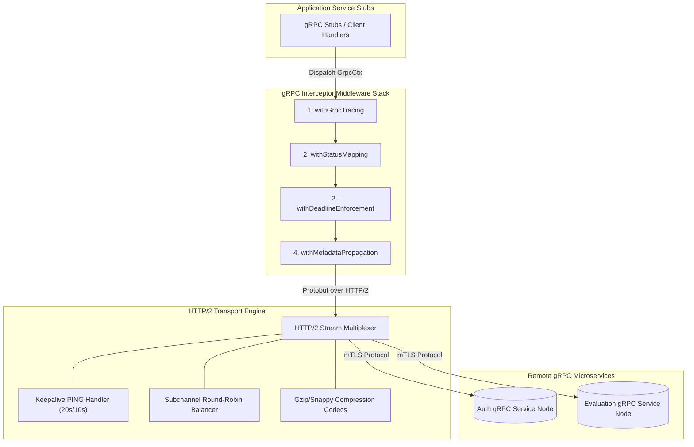
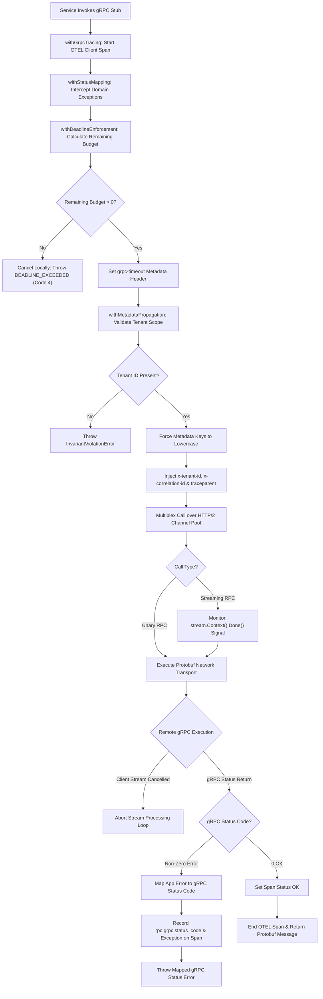
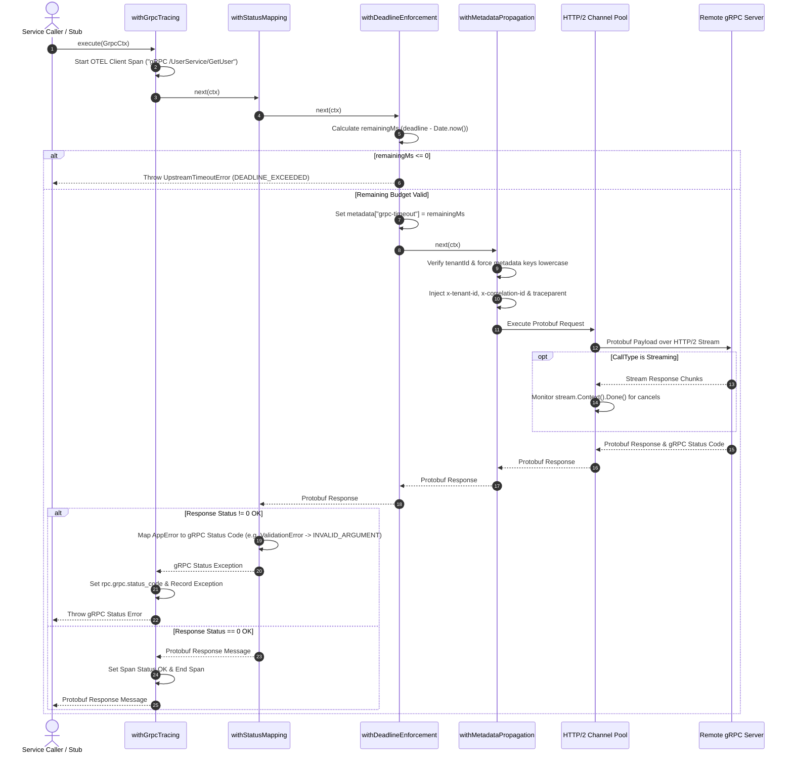

# Master Reference: gRPC & RPC Interceptor Middleware Architecture

*(Language-agnostic — TypeScript-flavored pseudocode, maps directly to Go, Python, Rust, Java, C++, C#)*

This document specifies the master middleware engine for **gRPC Client & Server Interceptors** (Unary and Streaming RPCs) across the platform.

Related references:
- REST Middleware: [`rest-api-middleware.md`](file:///home/btpl-lap-22/live/llm-observability-platform/policies/rules/codeQuality/middleware/rest-api-middleware.md)
- Event Streaming Middleware: [`kafka-middleware.md`](file:///home/btpl-lap-22/live/llm-observability-platform/policies/rules/codeQuality/middleware/kafka-middleware.md)

---

## PART A — High Level Design (HLD)

The gRPC Interceptor Middleware Engine acts as the unified interceptor layer for unary RPCs and streaming RPC channels (Client, Server, Bidirectional) across internal microservices.



### Key Components & Boundaries
1. **gRPC Stub Wrapper**: Provides type-safe client methods for unary and streaming calls.
2. **Metadata Context Engine (`withMetadataPropagation`)**: Enforces tenant header isolation, lowercases metadata keys, and injects W3C trace identifiers and `grpc-timeout` values.
3. **Status Translator (`withStatusMapping`)**: Maps internal platform domain errors to canonical gRPC status codes (`INVALID_ARGUMENT`, `UNAUTHENTICATED`, `NOT_FOUND`, `UNAVAILABLE`, etc.).
4. **Deadline Budget Enforcement (`withDeadlineEnforcement`)**: Verifies remaining call budget before sending network frames, preventing dead calls on remote servers.
5. **HTTP/2 Channel Pool Manager**: Manages long-lived multiplexed TCP connections with HTTP/2 keepalive PINGs and round-robin load balancing.

---

## PART B — Pipeline Flow & Sequence Diagrams

### 1. High-Level Decision & Execution Flowchart



### 2. End-to-End Execution Sequence Diagram



---

## PART C — Low Level Design (LLD)

### 1. Data Structures & Types
```typescript
type Next<Ctx, Result> = (ctx: Ctx) => Promise<Result>;
type Middleware<Ctx, Result> = (next: Next<Ctx, Result>) => Next<Ctx, Result>;

type GrpcCallType = "UNARY" | "CLIENT_STREAMING" | "SERVER_STREAMING" | "BIDI_STREAMING";

type GrpcCtx<Req = unknown, Res = unknown> = {
  service: string;
  method: string;
  callType: GrpcCallType;
  metadata: Record<string, string>;
  request?: Req;
  response?: Res;
  tenantId: string;
  correlationId: string;
  deadline: number; // UNIX timestamp (ms)
  attempt: number;
};
```

---

## PART D — gRPC Guardrails (G1–G15)

**G1.** Never execute raw gRPC stubs directly without wrapping stub calls in standard gRPC client interceptors.

**G2. Mandatory Metadata Context Propagation:** Every outbound gRPC request must attach `x-correlation-id`, `x-tenant-id`, and W3C `traceparent` metadata headers.

**G3. Strict gRPC Status Code Mapping:** Internal platform errors must map to standard gRPC status codes (`INVALID_ARGUMENT`, `UNAUTHENTICATED`, `PERMISSION_DENIED`, `NOT_FOUND`, `RESOURCE_EXHAUSTED`, `DEADLINE_EXCEEDED`, `UNAVAILABLE`).

**G4. Deadline Propagation:** Client-side deadlines must be converted to gRPC timeout metadata (`grpc-timeout`) and respected on the receiving server side.

**G5. Stream Cancellation Handling:** Stream handlers must listen for client cancellation signals (`context.Canceled` / `CANCELLED` status) and abort server resource allocation immediately.

**G6. Maximum Message Size Enforcement:** Inbound and outbound gRPC messages must enforce strict size caps (e.g. 4MB) to prevent buffer overflow attacks.

**G7. Keepalive Ping Configuration:** gRPC HTTP/2 connections must configure keepalive pings (e.g., 20s interval, 10s timeout) to detect stale or dropped TCP sockets.

**G8. Request Payload Validation:** Unary gRPC request payloads must be validated via Protobuf validation rules or Zod schema interceptors before reaching service methods.

**G9. Rate Limiting Interceptors:** Server-side gRPC interceptors must enforce tenant rate limits using gRPC status code `RESOURCE_EXHAUSTED` (14).

**G10. Channel Pooling & Re-use:** gRPC client channels must be created once per target service and re-used across concurrent calls.

**G11. Error Details Payload:** Complex error metadata must be attached using standard `google.rpc.Status` message details rather than unstructured error strings.

**G12. TLS Security & Certificate Validation:** All cross-service gRPC communication must enforce mTLS (Mutual TLS) with strict CA certificate validation.

**G13. Load Balancing Strategy:** Outbound gRPC channels must use round-robin or latency-based client-side load balancing (`pick_first` prohibited in prod).

**G14. Structured Access Logging:** Every gRPC call completion must produce structured log records enriched with method, status code, latency, and tenant context.

**G15. CI Interceptor Registration Check:** Build linters verify that all gRPC service definitions register the full interceptor stack.

---

## PART E — gRPC Interceptor Middleware Engine (Full Implementation)

### 1. `withGrpcTracing` — OpenTelemetry gRPC Spans
```typescript
const withGrpcTracing: Middleware<GrpcCtx, unknown> = (next) => async (ctx) => {
  const span = tracer.startSpan(`gRPC ${ctx.service}/${ctx.method}`, {
    kind: SpanKind.CLIENT,
    attributes: {
      "rpc.system": "grpc",
      "rpc.service": ctx.service,
      "rpc.method": ctx.method,
      "tenant.id": ctx.tenantId,
      "correlation.id": ctx.correlationId,
    },
  });

  injectW3CTraceContext(span, ctx.metadata);
  ctx.metadata["x-correlation-id"] = ctx.correlationId;
  ctx.metadata["x-tenant-id"] = ctx.tenantId;

  try {
    const response = await next(ctx);
    span.setStatus({ code: SpanStatusCode.OK });
    return response;
  } catch (err) {
    span.recordException(err as Error);
    span.setAttribute("rpc.grpc.status_code", mapErrorToGrpcStatusCode(err));
    span.setStatus({ code: SpanStatusCode.ERROR, message: (err as Error).message });
    throw err;
  } finally {
    span.end();
  }
};
```

### 2. `withMetadataPropagation` — Tenant & Header Context
```typescript
const withMetadataPropagation = (): Middleware<GrpcCtx, unknown> => (next) => async (ctx) => {
  if (!ctx.tenantId) {
    throw new InvariantViolationError({ message: "gRPC client call rejected: Missing tenantId" });
  }

  ctx.metadata["x-tenant-id"] = ctx.tenantId;
  ctx.metadata["x-correlation-id"] = ctx.correlationId;

  const remainingMs = ctx.deadline - Date.now();
  if (remainingMs > 0) {
    ctx.metadata["grpc-timeout"] = `${remainingMs}m`;
  }

  return next(ctx);
};
```

### 3. `withStatusMapping` — Error Taxonomy Translator
```typescript
const withStatusMapping = (): Middleware<GrpcCtx, unknown> => (next) => async (ctx) => {
  try {
    return await next(ctx);
  } catch (err) {
    throw mapErrorToGrpcError(err, ctx.correlationId);
  }
};

function mapErrorToGrpcStatusCode(err: unknown): number {
  if (err instanceof ValidationError) return 3; // INVALID_ARGUMENT
  if (err instanceof NotFoundError) return 5; // NOT_FOUND
  if (err instanceof UnauthorizedError) return 16; // UNAUTHENTICATED
  if (err instanceof ForbiddenError) return 7; // PERMISSION_DENIED
  if (err instanceof UpstreamTimeoutError) return 4; // DEADLINE_EXCEEDED
  if (err instanceof UpstreamUnavailableError) return 14; // UNAVAILABLE
  return 2; // UNKNOWN
}
```

### 4. `withDeadlineEnforcement` — Timeout Budget Verification
```typescript
const withDeadlineEnforcement = (): Middleware<GrpcCtx, unknown> => (next) => async (ctx) => {
  const remainingMs = ctx.deadline - Date.now();
  if (remainingMs <= 0) {
    throw new UpstreamTimeoutError({ message: "gRPC deadline budget exhausted before call", retryable: false });
  }

  return next(ctx);
};
```

---

## PART F — 35 Comprehensive gRPC Edge Cases Catalog

**E1. Unhandled Stream Cancellation Resource Leak.** Client disconnects a bidirectional or server streaming RPC call mid-stream; server handler loop ignores context cancellation signal and continues generating records in background. *Impact:* CPU and memory leak on server pods. *Middleware Solution:* Server stream interceptor checks `stream.Context().Done()` on every message emit, aborting processing loop instantly when client disconnects.

**E2. Metadata Key Lowercase Violation.** Client middleware attaches custom metadata with uppercase letters (`X-Tenant-ID: "123"`). *Impact:* gRPC HTTP/2 transport engine rejects request with protocol error `invalid header field name`. *Middleware Solution:* `withMetadataPropagation` automatically forces all metadata keys to lowercase (`x-tenant-id`) before handing off to gRPC channel driver.

**E3. HTTP/2 Connection Stalled Ping Drop.** Intermediate cloud firewall silently drops TCP connection without emitting TCP RST frame; gRPC client channel hangs indefinitely waiting for response. *Impact:* Caller threads block forever. *Middleware Solution:* gRPC channel configuration mandates HTTP/2 PING keepalives (`grpc.keepalive_time_ms: 20000`, `grpc.keepalive_timeout_ms: 10000`) to detect and tear down dead TCP connections.

**E4. Protobuf Max Message Size Limit Exceeded.** Server returns a 6MB Protobuf response message, but gRPC client has default 4MB `max_receive_message_length` cap. *Impact:* Call fails abruptly with status `RESOURCE_EXHAUSTED` (code 8). *Middleware Solution:* Channel initialization middleware sets `max_receive_message_length` to 16MB or enforces server-side pagination / streaming for large payloads.

**E5. gRPC Status Code Ambiguity Across Languages.** Go service returns `codes.Canceled`, but Python/TypeScript client maps this to generic `UNAVAILABLE`, confusing retry logic. *Impact:* Invalid retry behavior on user-initiated cancellations. *Middleware Solution:* Interceptor status mapper enforces canonical mapping tables across language SDKs according to gRPC specification standards.

**E6. Deadlock on Blocking gRPC Client Stub in Event Loop.** Developer invokes synchronous gRPC call (`client.GetSync()`) inside Node.js or Python asyncio event loop thread. *Impact:* Event loop freezes completely, blocking all incoming HTTP and RPC requests. *Middleware Solution:* Linter and async wrapper enforce non-blocking promise-based or async/await gRPC stub invocations.

**E7. Client-Side Channel Re-creation Overhead.** Application code instantiates a new `grpc.ClientChannel` per request rather than reusing channels. *Impact:* Excessive CPU load from repeated TLS handshakes and connection pool churn. *Middleware Solution:* Channel factory middleware caches and reuses long-lived channels per target service host.

**E8. Missing Deadline Propagation in Nested gRPC Calls.** Service A calls Service B with 5,000ms deadline; Service B calls Service C but forgets to propagate `grpc-timeout` metadata. Service C runs for 20 seconds. *Impact:* Service A times out, but Service C continues executing wasted background work. *Middleware Solution:* `withDeadlineEnforcement` extracts incoming deadline and injects remaining budget into outgoing `grpc-timeout` metadata automatically.

**E9. Large Protobuf Deserialization CPU Spike.** Single gRPC call receives a Protobuf payload containing 100,000 nested repeated fields; un-marshalling blocks Node.js event loop for 120ms. *Impact:* High latency spikes across concurrent requests. *Middleware Solution:* Deserialization interceptor offloads heavy Protobuf decoding to background worker threads when payload bytes exceed 1MB.

**E10. Load Balancer Subchannel Starvation.** Outbound gRPC channel connects to Kubernetes Service IP using `pick_first` load balancer mode; all traffic routes to single pod instance. *Impact:* Severe load imbalance where 1 pod hits 100% CPU while 9 pods sit idle. *Middleware Solution:* Channel builder forces `round_robin` client-side load balancing or uses gRPC lookaside load balancer (Envoy / gRPC xDS).

**E11. Silent Metadata Truncation on Header Overload.** Application passes 10KB of trace/baggage data in gRPC metadata; HTTP/2 proxy rejects metadata header frame >8KB. *Impact:* `INTERNAL` or `PROTOCOL_ERROR` HTTP/2 failures. *Middleware Solution:* Metadata interceptor caps max metadata payload size to 4KB, trimming non-critical baggage keys.

**E12. Concurrent Stream ID Exhaustion.** Single HTTP/2 connection reaches maximum concurrent streams limit (e.g., 100 streams); subsequent RPC calls block waiting for streams to close. *Impact:* Latency spikes on concurrent streaming calls. *Middleware Solution:* Channel pool manager multiplexes requests across multiple underlying TCP channels when active streams hit 80% capacity limit.

**E13. Raw Panic / Unhandled Exception Leak.** Server implementation throws an unhandled exception (e.g. null pointer panic); default gRPC server exposes raw internal stack trace string to client. *Impact:* Security vulnerability exposing internal codebase paths and architecture details. *Middleware Solution:* Server error interceptor catches unhandled panics, logs full stack trace to secure internal logger, and returns sanitized `INTERNAL` status code to client.

**E14. Sub-millisecond Deadline Truncation.** Remaining deadline budget is 0.5ms when calling gRPC stub. *Impact:* Outbound gRPC network request initiates but immediately fails at remote server boundary. *Middleware Solution:* `withDeadlineEnforcement` checks remaining budget; if <5ms, it cancels call locally with `DEADLINE_EXCEEDED` before sending bytes over wire.

**E15. TLS Certificate Expiration During Active Channel.** Long-lived gRPC channel remains open; server mTLS certificate expires or rotates; next RPC fails with `UNAUTHENTICATED` or TLS verification error. *Impact:* Intermittent gRPC failures post-cert rotation. *Middleware Solution:* Channel interceptor implements dynamic mTLS certificate reloader that refreshes TLS credentials without dropping active channels.

**E16. Protobuf Enum Zero Value Incompatibility.** Proto3 enum uses 0 as default (`UNKNOWN = 0`); client omits field; server cannot distinguish between "field not set" vs "explicitly set to UNKNOWN". *Impact:* Logic bugs in state machine evaluation. *Middleware Solution:* Schema guardrails mandate explicit `UNSPECIFIED = 0` as first enum value across all Protobuf definitions.

**E17. Retry Storm on UNAVAILABLE Status.** Microservice restarts; 50 client pods receive `UNAVAILABLE` and retry immediately without backoff. *Impact:* Restarting pod is overwhelmed with connection requests and crashes again (thundering herd). *Middleware Solution:* gRPC client retry middleware applies exponential backoff with full jitter (e.g., 100ms * 2^attempt + rand(0, 100)) and caps max retry attempts to 3.

**E18. Unauthenticated Health Check Endpoint Drop.** Auth interceptor rejects `/grpc.health.v1.Health/Check` because health probe lacks Bearer token. *Impact:* Kubernetes readiness probe fails, causing pod restart loops. *Middleware Solution:* Auth interceptor explicitly bypasses authentication checks for standard gRPC health check method paths.

**E19. Stream Memory Backpressure Exhaustion.** Server streams items at 10,000 msg/sec to slow client reading at 100 msg/sec; server buffer accumulates un-sent messages in RAM. *Impact:* Server process heap memory spike and crash. *Middleware Solution:* Server stream interceptor checks `stream.Send()` return state / flow control signals and pauses generation when client buffer is full.

**E20. Non-Standard gRPC-Web Proxy Header Stripping.** Web browser client calling gRPC service via Envoy gRPC-Web proxy has custom `x-tenant-id` header stripped by CORS/proxy settings. *Impact:* Server receives request missing tenant context. *Middleware Solution:* Envoy / proxy configuration and server interceptor validate allowed CORS metadata headers (`Access-Control-Expose-Headers`).

**E21. HTTP/2 GOAWAY Frame Handling during Graceful Shutdown.** Server initiates graceful shutdown and emits HTTP/2 `GOAWAY` frame; client receives `GOAWAY` but continues sending new RPCs on old channel. *Impact:* Failed requests during rolling deployments. *Middleware Solution:* gRPC client channel driver intercepts `GOAWAY` frames and instantly shifts new RPC calls to alternative healthy channel endpoints.

**E22. Streaming Compression Codec Mismatch (Gzip vs Identity).** Server sends Gzip-compressed gRPC stream chunks, but client channel lacks Gzip decompressor registration. *Impact:* RPC fails with `UNIMPLEMENTED` compression codec error. *Middleware Solution:* Interceptor stack registers standard compression codecs (`gzip`, `snappy`, `identity`) on both client and server channels at boot.

**E23. Protobuf Oneof Field Type Casting Drift.** Client sets field `oneof_payload.text`, but server code attempts to access `oneof_payload.json` without type checking. *Impact:* Null pointer exception when accessing unset `oneof` field. *Middleware Solution:* Validation interceptor checks `oneof` presence explicitly before forwarding request to service handler.

**E24. Cross-Region gRPC Latency Spike without Connection Warming.** First gRPC call across cloud regions takes 200ms due to cold TCP + TLS 1.3 handshake. *Impact:* High latency for first user request post-deployment. *Middleware Solution:* Channel factory executes background ping calls (`gRPC Health Check`) to pre-warm cross-region channels at startup.

**E25. gRPC-Web Binary Protobuf vs Text/JSON Transcoding Error.** Frontend sends `application/grpc-web-text` (base64 encoded), but backend expects `application/grpc-web+proto` (binary). *Impact:* Payload decode failure at proxy layer. *Middleware Solution:* gRPC-Web interceptor automatically detects and handles both binary and base64 text payloads.

**E26. Client-Side Stream Writer Blocking main Thread.** Calling `stream.Send(msg)` inside tight loop blocks single-threaded event loop when buffer is full. *Impact:* Application responsiveness drops. *Middleware Solution:* Streaming client interceptor wraps `.Send()` in backpressure-aware async queue.

**E27. Metadata Binary Header Encoding (`-bin` suffix rule).** Passing raw byte array in gRPC metadata key without `-bin` suffix (`x-custom-data` instead of `x-custom-data-bin`) throws invalid ASCII metadata error. *Impact:* Protocol error crash. *Middleware Solution:* Metadata interceptor verifies that binary byte metadata keys end with mandatory `-bin` suffix.

**E28. Server Interceptor Context Key Type Collision.** Two independent server interceptors store values in context using string key `"tenant"`; Interceptor B overwrites Interceptor A's value. *Impact:* Context corruption. *Middleware Solution:* Interceptors use unexported custom type context keys (`type tenantKeyType struct{}`) to guarantee zero key collisions.

**E29. Stream Header vs Stream Trailer Metadata Separation.** Server attempts to send header metadata *after* first stream response message has already been transmitted. *Impact:* Header metadata ignored or thrown as protocol error. *Middleware Solution:* Stream interceptor enforces sending header metadata before transmitting first message, sending post-processing metadata via Trailers.

**E30. gRPC Channel State Transition Loop (TRANSIENT_FAILURE).** Target service is unreachable; client channel enters `TRANSIENT_FAILURE` and continuously attempts reconnect every 10ms. *Impact:* CPU resource burn from high-frequency reconnect loops. *Middleware Solution:* Channel state monitor applies exponential backoff on reconnect attempts during `TRANSIENT_FAILURE`.

**E31. Protobuf Field Deprecation Warning Leak.** Protobuf definition marks field `[deprecated = true]`; client uses deprecated field; logs fill with deprecation warnings. *Impact:* Log noise. *Middleware Solution:* Lint rules detect deprecated field usage in PRs; interceptor logs aggregated deprecation metric instead of noisy log lines.

**E32. Concurrent Mutex Contention inside Client Interceptor Stack.** 500 threads pass through client interceptor holding non-rentrant mutex to log request metrics. *Impact:* Interceptor stack becomes single-threaded bottleneck. *Middleware Solution:* Interceptors use lock-free atomic counters or ring buffers for metric recording.

**E33. gRPC Keepalive Permit Without Calls Enforcement (`too_many_pings`).** Client sends HTTP/2 pings on idle connection when `permit_without_calls` is disabled on server. *Impact:* Server sends `ENHANCE_YOUR_CALM` and closes connection. *Middleware Solution:* Client keepalive interceptor aligns keepalive settings with server `ClientParameters` policy.

**E34. Dual Stack IPv4/IPv6 Resolution Failure in gRPC Name Resolver.** Name resolver resolves domain to IPv6 address, but local network lacks IPv6 routing. *Impact:* gRPC channel fails to connect. *Middleware Solution:* Name resolver configures dual-stack Happy Eyeballs algorithm attempting IPv4 and IPv6 connections concurrently.

**E35. Streaming Reconnection Offset Loss on Connection Drop.** Long-running server stream drops at item 5,000; client reconnects and restarts stream from item 0. *Impact:* Duplicate record processing on client. *Middleware Solution:* Stream interceptor propagates last-seen sequence offset header on reconnect to resume stream from drop point.

---

## PART G — Edge Case Coverage Mapping Matrix

| Edge Case | HLD Module | LLD Function / Component | Pipeline Stage |
|---|---|---|---|
| **E1** (Stream Leak) | HTTP/2 Transport | `StreamContextCancelMonitor` | Stage 5 (Transport Channel) |
| **E2** (Metadata Case)| Metadata Engine | `withMetadataPropagation` (Lowercase keys) | Stage 4 (`withMetadataPropagate`)|
| **E3** (Stalled Ping) | HTTP/2 Transport | `Http2KeepAlivePing` (20s/10s) | Stage 5 (Transport Channel) |
| **E4** (Message Size) | HTTP/2 Transport | `MaxReceiveMessageSizeSetter` (16MB) | Stage 5 (Transport Channel) |
| **E5** (Status Code) | Status Translator| `withStatusMapping` (Canonical tables)| Stage 2 (`withStatusMapping`) |
| **E6** (Blocking Stub)| Stub Wrapper | `AsyncPromiseStubWrapper` | Stage 1 (`withGrpcTracing`) |
| **E7** (Channel Pool)| Channel Pool | `ChannelFactoryCache` | Stage 5 (Transport Channel) |
| **E8** (Deadline Prop)| Deadline Engine | `withDeadlineEnforcement` | Stage 3 (`withDeadlineEnforce`) |
| **E9** (Proto Decode) | HTTP/2 Transport | `WorkerThreadProtobufDecoder` | Stage 5 (Transport Channel) |
| **E10** (Load Balance)| Channel Pool | `RoundRobinSubchannelBalancer` | Stage 5 (Transport Channel) |
| **E11** (Header Overload)| Metadata Engine| `MetadataSizeLimiter` (Max 4KB) | Stage 4 (`withMetadataPropagate`)|
| **E12** (Stream Limit) | Channel Pool | `ChannelMultiplexer` (80% capacity)| Stage 5 (Transport Channel) |
| **E13** (Panic Leak) | Status Translator| `ServerPanicCatchInterceptor` | Stage 2 (`withStatusMapping`) |
| **E14** (Sub-ms Budget)| Deadline Engine | `withDeadlineEnforcement` (<5ms check) | Stage 3 (`withDeadlineEnforce`) |
| **E15** (mTLS Cert) | Channel Pool | `DynamicMtlsCertificateReloader` | Stage 5 (Transport Channel) |
| **E16** (Enum Zero) | Stub Wrapper | `Proto3UnspecifiedEnumGuard` | Stage 1 (`withGrpcTracing`) |
| **E17** (Retry Storm) | Status Translator| `JitteredBackoffRetryInterceptor` | Stage 2 (`withStatusMapping`) |
| **E18** (Health Auth) | Metadata Engine | `HealthCheckAuthBypass` | Stage 4 (`withMetadataPropagate`)|
| **E19** (Backpressure) | HTTP/2 Transport | `StreamSendFlowController` | Stage 5 (Transport Channel) |
| **E20** (CORS Metadata)| Metadata Engine | `GrpcWebCorsHeaderExposer` | Stage 4 (`withMetadataPropagate`)|
| **E21** (GOAWAY Frame) | Channel Pool | `GoawayFrameHandler` | Stage 5 (Transport Channel) |
| **E22** (Compression) | HTTP/2 Transport | `GzipCodecRegistrar` | Stage 5 (Transport Channel) |
| **E23** (Oneof Drift) | Stub Wrapper | `OneofPresenceChecker` | Stage 1 (`withGrpcTracing`) |
| **E24** (Cold Handshake)| Channel Pool | `CrossRegionChannelWarmer` | Stage 5 (Transport Channel) |
| **E25** (gRPC-Web Text)| HTTP/2 Transport | `GrpcWebFormatTranscoder` | Stage 5 (Transport Channel) |
| **E26** (Stream Send) | HTTP/2 Transport | `AsyncStreamSendQueue` | Stage 5 (Transport Channel) |
| **E27** (Binary Suffix)| Metadata Engine | `BinaryMetadataSuffixValidator` (`-bin`) | Stage 4 (`withMetadataPropagate`)|
| **E28** (Context Key) | Metadata Engine | `UnexportedContextKeyType` | Stage 4 (`withMetadataPropagate`)|
| **E29** (Trailers Sep) | Metadata Engine | `HeaderTrailerOrderInterceptor` | Stage 4 (`withMetadataPropagate`)|
| **E30** (Transient Loop)| Channel Pool | `ChannelStateBackoffMonitor` | Stage 5 (Transport Channel) |
| **E31** (Deprecation) | Stub Wrapper | `DeprecatedFieldMetricLogger` | Stage 1 (`withGrpcTracing`) |
| **E32** (Mutex Lock) | Status Translator| `LockFreeMetricCounter` | Stage 2 (`withStatusMapping`) |
| **E33** (Too Many Pings)| HTTP/2 Transport | `KeepalivePermitPolicyAligner` | Stage 5 (Transport Channel) |
| **E34** (IPv6 Resolver)| Channel Pool | `HappyEyeballsDualStackResolver` | Stage 5 (Transport Channel) |
| **E35** (Stream Offset)| HTTP/2 Transport | `StreamSequenceOffsetHeader` | Stage 5 (Transport Channel) |

---

## PART H — Naive vs. Architecture Comparison

| Concern | Naive gRPC Calls | This Architecture | Value Delivered |
|---|---|---|---|
| Metadata | Hand-written header maps | `withMetadataPropagation` | Automated trace & tenant propagation |
| Timeouts | Missing deadlines; hanging calls | `withDeadlineEnforcement` | Universal deadline budget enforcement |
| Error Mapping | Raw exceptions or custom codes | `withStatusMapping` | Strict gRPC status code compliance |
| Streaming | Resource leaks on client drop | Cancel-aware stream interceptors | Zero server stream leaks |

---

## PART I — gRPC Interceptor Composition Cheat Sheet

```
gRPC CALL PIPELINE (outside → in):

  withGrpcTracing              (outermost — tracks latency & status codes)
  → withStatusMapping          (translates internal errors to gRPC status codes)
  → withDeadlineEnforcement    (verifies remaining deadline budget)
  → withMetadataPropagation    (attaches tenant, correlation & trace metadata)
  → rawGrpcStub.execute()      (innermost gRPC network call)
```
