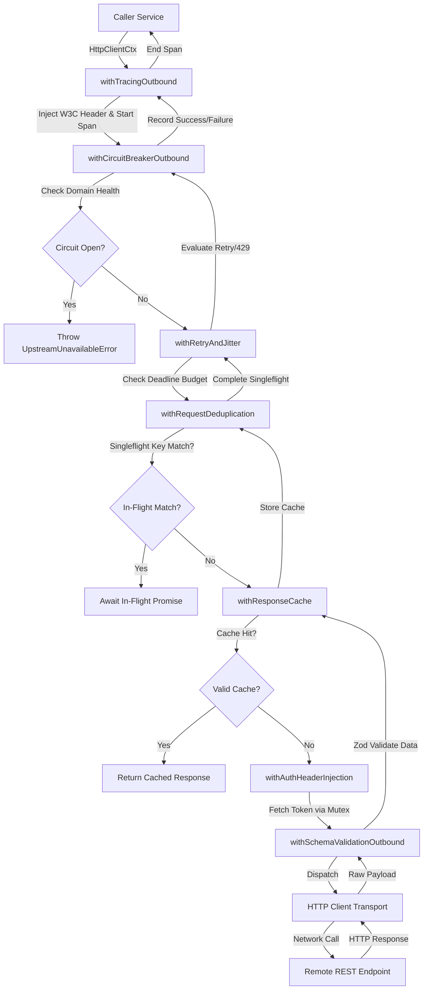

# Master Reference: Outbound REST API Client & HTTP Endpoint Middleware Architecture

*(Language-agnostic — TypeScript-flavored pseudocode, maps directly to Go, Python, Rust, Java, C++, C#)*

This document specifies the master middleware engine for **Outbound REST API Client calls** and **HTTP Request/Response Pipelines** across the platform.

Related references:
- Event Streaming Middleware: [`kafka-middleware.md`](file:///home/btpl-lap-22/live/llm-observability-platform/policies/rules/codeQuality/middleware/kafka-middleware.md)
- Database Middleware: [`database-middleware.md`](file:///home/btpl-lap-22/live/llm-observability-platform/policies/rules/codeQuality/middleware/database-middleware.md)

---

## PART A — High Level Design (HLD)

The Outbound REST Middleware Engine sits at the boundary between application domain logic and remote HTTP endpoints (internal microservices, 3rd-party APIs, webhooks).

```
┌──────────────────────────────────────────────────────────────────────────────────┐
│                             APPLICATION DOMAIN LAYER                              │
│         (Services, Sagas, Workflows — zero raw fetch/http client calls)           │
└─────────────────────────────────────────┬────────────────────────────────────────┘
                                          │ invoke HTTP Request
                                          ▼
┌──────────────────────────────────────────────────────────────────────────────────┐
│                    OUTBOUND REST MIDDLEWARE ENGINE PIPELINE                      │
│                                                                                  │
│   ┌──────────────────────┐   ┌──────────────────────┐   ┌────────────────────┐   │
│   │ withTracingOutbound  │──►│withCircuitBreaker    │──►│ withRetryAndJitter │   │
│   └──────────────────────┘   └──────────────────────┘   └─────────┬──────────┘   │
│                                                                   │              │
│   ┌──────────────────────┐   ┌──────────────────────┐   ┌─────────▼──────────┐   │
│   │withSchemaValidation  │◄──│withAuthHeaderInject  │◄──│withRequestDedupe   │   │
│   └──────────┬───────────┘   └──────────────────────┘   └────────────────────┘   │
└──────────────┼───────────────────────────────────────────────────────────────────┘
               │ Dispatch Transformed Request
               ▼
┌──────────────────────────────────────────────────────────────────────────────────┐
│                              HTTP TRANSPORT ENGINE                               │
│        (Socket Pool Manager, TLS Handshake, DNS Resolver, HTTP/2 PING)           │
└─────────────────────────────────────────┬────────────────────────────────────────┘
                                          │ Wire Protocol (HTTPS)
                                          ▼
┌──────────────────────────────────────────────────────────────────────────────────┐
│                           REMOTE REST API ENDPOINTS                              │
└──────────────────────────────────────────────────────────────────────────────────┘
```

### Key Components & Boundaries
1. **Domain Isolation Facade**: Exposes typed client methods; completely decouples application code from HTTP transport concerns.
2. **Context Engine (`HttpClientCtx`)**: Thread-safe mutable context carrying request options, W3C trace identifiers, tenant identity, and absolute UNIX deadline budgets.
3. **Resilience & Fault Isolation Layer**: Composed decorators (`CircuitBreaker`, `RetryWithJitter`, `SingleflightDedupe`, `ResponseCache`) enforcing fault containment.
4. **Anti-Corruption Schema Adapter**: Enforces `fromApi`/`toApi` transformations, ensuring remote data shapes conform to platform schemas before entering domain logic.
5. **Managed Transport Pool**: HTTP/1.1 and HTTP/2 socket pool manager handling keep-alive, DNS TTL caps, TLS handshake timeouts, and chunked stream decompression.

---

## PART B — Pipeline Diagrams (Mermaid & ASCII)

### Structural & Control Flow Diagram (Mermaid)



### Detailed Layer Pipeline (ASCII)

```
OUTBOUND REST CLIENT PIPELINE (outside → in):

  [Entry] Caller invokes adapter method
    │
    ▼
  1. withTracingOutbound
     ├── Extract parent OTEL trace context
     ├── Create Client Span ("HTTP POST /api/v1/resource")
     └── Inject W3C `traceparent`, `x-correlation-id`, `x-tenant-id`
    │
    ▼
  2. withCircuitBreakerOutbound
     ├── Extract domain hostname from request URL
     ├── Query Circuit Breaker registry for target domain
     └── IF OPEN -> Short-circuit throw `UpstreamUnavailableError`
    │
    ▼
  3. withRetryAndJitter
     ├── Calculate remaining deadline budget (`deadline - Date.now()`)
     ├── IF remaining budget <= 0 -> Throw `UpstreamTimeoutError`
     ├── Execute inner pipeline
     ├── ON 429 -> Parse `Retry-After` header & sleep jitter duration
     └── ON Retryable Error -> Calculate exponential backoff + full jitter & retry
    │
    ▼
  4. withRequestDeduplication (Singleflight)
     ├── IF Method == GET: Compute key `tenantId:method:url:queryParams`
     └── IF in-flight -> Wait and share promise result; ELSE execute inner
    │
    ▼
  5. withResponseCache
     ├── IF Method == GET: Query CacheStore (`http_cache:tenantId:hash`)
     └── IF Cache Hit -> Return cached HttpResponse; ELSE execute inner
    │
    ▼
  6. withAuthHeaderInjection
     ├── Acquire singleflight token refresh mutex
     ├── Obtain valid Bearer token for tenant
     └── Inject `Authorization: Bearer <token>` header
    │
    ▼
  7. withSchemaValidationOutbound
     ├── Execute raw HTTP client network transport call
     ├── Receive raw HTTP response status & body
     ├── IF Status >= 400 -> Map to platform Error Taxonomy (`mapErrorToTaxonomy`)
     └── Parse & validate payload via `schema.parse(data)` -> Return validated object
    │
    ▼
  [Exit] Validated HttpResponse returned to caller
```

---

## PART C — Low Level Design (LLD)

### 1. Data Structures & Types
```typescript
type Next<Ctx, Result> = (ctx: Ctx) => Promise<Result>;
type Middleware<Ctx, Result> = (next: Next<Ctx, Result>) => Next<Ctx, Result>;

type HttpRequestOptions = {
  url: string;
  method: "GET" | "POST" | "PUT" | "PATCH" | "DELETE";
  headers: Record<string, string>;
  queryParams?: Record<string, string | number | boolean>;
  body?: unknown;
  timeoutMs?: number;
};

type HttpResponse<T = unknown> = {
  status: number;
  headers: Record<string, string>;
  data: T;
};

type HttpClientCtx<T = unknown> = {
  request: HttpRequestOptions;
  response?: HttpResponse<T>;
  correlationId: string;
  tenantId: string;
  deadline: number; // Absolute UNIX timestamp (ms)
  attempt: number;
  metadata: Record<string, unknown>;
};
```

### 2. Universal Pipeline Composer
```typescript
function compose<Ctx, Result>(...middlewares: Middleware<Ctx, Result>[]): Middleware<Ctx, Result> {
  return (final) => middlewares.reduceRight((next, mw) => mw(next), final);
}
```

---

## PART D — Outbound REST Guardrails (R1–R15)

**R1.** Never execute bare `fetch()`, `axios()`, or HTTP client requests directly inside service or repository code. All outbound HTTP calls must use an adapter wrapped in the standard REST middleware pipeline.

**R2.** Every outbound request must carry `x-correlation-id`, `x-tenant-id`, and W3C `traceparent` headers.

**R3.** Every outbound call must enforce an absolute timeout/deadline derived from the incoming context.

**R4.** Retries are allowed **only** for requests classified as `retryable: true` (e.g. 502, 503, 504, network connection resets, or 429 with Retry-After). Mutating requests (POST/PATCH) MUST include an `Idempotency-Key` header if retried.

**R5.** Exponential backoff for retries **must** incorporate full jitter to prevent synchronized retry storms against upstream services.

**R6.** Upstream 429 (Too Many Requests) responses **must** honor the upstream `Retry-After` header value (seconds or HTTP date).

**R7.** A circuit breaker instance **must** be shared per upstream target domain/service, preventing cascade failure across concurrent threads.

**R8.** Upstream auth token retrieval and refresh must be thread-safe (singleflight mutex), preventing multiple parallel requests from refreshing tokens simultaneously.

**R9.** Outbound HTTP response bodies must be validated through a schema transformer (`fromApi`) before returning to the caller.

**R10.** Sensitive headers (`Authorization`, `x-api-key`, `Cookie`) must be automatically redacted in outgoing request trace logs.

**R11.** Response caching (if enabled) must be keyed on deterministic request hash (`method:url:queryParams:bodyHash:tenantId`) and enforce explicit TTLs with stale-while-revalidate capability.

**R12.** Connection pool sockets must have explicit max idle time, max total sockets, and socket keep-alive enabled to prevent socket leaks.

**R13.** Non-2xx HTTP responses must be mapped by `mapErrorToTaxonomy` into platform errors (`UpstreamTimeoutError`, `UpstreamUnavailableError`, etc.) before surfacing to business logic.

**R14.** Outbound HTTP request payloads larger than configured limits (e.g. 5MB) must use streaming or chunked transfer encoding.

**R15.** CI linters verify that all outbound HTTP client adapters are registered with the standard middleware pipeline order.

---

## PART E — Outbound REST Client Middleware Engine (Full Implementation)

### 1. `withTracingOutbound` — W3C Trace Context & OTEL Span
```typescript
const withTracingOutbound: Middleware<HttpClientCtx, HttpResponse> = (next) => async (ctx) => {
  const span = tracer.startSpan(`HTTP ${ctx.request.method} ${getSanitizedUrl(ctx.request.url)}`, {
    kind: SpanKind.CLIENT,
    attributes: {
      "http.method": ctx.request.method,
      "http.url": ctx.request.url,
      "tenant.id": ctx.tenantId,
      "correlation.id": ctx.correlationId,
    },
  });

  injectW3CTraceContext(span, ctx.request.headers);
  ctx.request.headers["x-correlation-id"] = ctx.correlationId;
  ctx.request.headers["x-tenant-id"] = ctx.tenantId;

  try {
    const response = await next(ctx);
    span.setAttribute("http.status_code", response.status);
    span.setStatus({ code: SpanStatusCode.OK });
    return response;
  } catch (err) {
    span.recordException(err as Error);
    span.setStatus({ code: SpanStatusCode.ERROR, message: (err as Error).message });
    throw err;
  } finally {
    span.end();
  }
};
```

### 2. `withAuthHeaderInjection` — Token Injection & Singleflight Refresh
```typescript
const withAuthHeaderInjection = (tokenProvider: TokenProvider): Middleware<HttpClientCtx, HttpResponse> => {
  const mutex = new SingleflightMutex<string>();

  return (next) => async (ctx) => {
    const token = await mutex.do("auth-token-refresh", () => tokenProvider.getValidToken(ctx.tenantId));
    ctx.request.headers["Authorization"] = `Bearer ${token}`;
    return next(ctx);
  };
};
```

### 3. `withCircuitBreakerOutbound` — Per-Upstream Fault Isolation
```typescript
const withCircuitBreakerOutbound = (breakerRegistry: BreakerRegistry): Middleware<HttpClientCtx, HttpResponse> =>
  (next) => async (ctx) => {
    const domain = new URL(ctx.request.url).hostname;
    const breaker = breakerRegistry.forDomain(domain);

    if (breaker.isOpen()) {
      throw new UpstreamUnavailableError({
        message: `Circuit breaker is OPEN for upstream target ${domain}`,
        retryable: true,
      });
    }

    try {
      const response = await next(ctx);
      if (response.status >= 500) breaker.recordFailure();
      else breaker.recordSuccess();
      return response;
    } catch (err) {
      breaker.recordFailure();
      throw err;
    }
  };
```

### 4. `withRetryAndJitter` — Deadline-Aware Backoff & Jitter
```typescript
const withRetryAndJitter = (opts: { maxAttempts: number; baseDelayMs: number }): Middleware<HttpClientCtx, HttpResponse> =>
  (next) => async (ctx) => {
    let attempt = 0;
    while (true) {
      attempt++;
      ctx.attempt = attempt;
      const remainingMs = ctx.deadline - Date.now();

      if (remainingMs <= 0) {
        throw new UpstreamTimeoutError({ message: "Outbound request deadline exceeded", retryable: false });
      }

      try {
        const response = await next(ctx);
        if (response.status === 429 && attempt < opts.maxAttempts) {
          const retryAfterMs = parseRetryAfterHeader(response.headers["retry-after"]) ?? calculateJitterDelay(attempt, opts.baseDelayMs);
          if (retryAfterMs < remainingMs) {
            await sleep(retryAfterMs);
            continue;
          }
        }
        return response;
      } catch (err) {
        if (!isRetryableHttpError(err) || attempt >= opts.maxAttempts) throw err;
        const delay = calculateJitterDelay(attempt, opts.baseDelayMs);
        if (delay >= remainingMs) {
          throw new UpstreamTimeoutError({ message: "Remaining deadline budget insufficient for retry", retryable: false });
        }
        await sleep(delay);
      }
    }
  };

function calculateJitterDelay(attempt: number, baseDelayMs: number): number {
  const exponential = baseDelayMs * 2 ** (attempt - 1);
  return Math.floor(Math.random() * exponential);
}
```

### 5. `withRequestDeduplication` — Concurrent In-Flight Singleflight
```typescript
const withRequestDeduplication = (): Middleware<HttpClientCtx, HttpResponse> => {
  const singleflight = new SingleflightGroup<HttpResponse>();

  return (next) => async (ctx) => {
    if (ctx.request.method !== "GET") return next(ctx);
    const key = `${ctx.tenantId}:${ctx.request.method}:${ctx.request.url}:${JSON.stringify(ctx.request.queryParams ?? {})}`;
    return singleflight.do(key, () => next(ctx));
  };
};
```

### 6. `withResponseCache` — Stale-While-Revalidate Caching
```typescript
const withResponseCache = (cacheStore: CacheStore, defaultTtlMs: number): Middleware<HttpClientCtx, HttpResponse> =>
  (next) => async (ctx) => {
    if (ctx.request.method !== "GET") return next(ctx);

    const cacheKey = `http_cache:${ctx.tenantId}:${hashRequest(ctx.request)}`;
    const cached = await cacheStore.get<HttpResponse>(cacheKey);
    if (cached) return cached;

    const response = await next(ctx);
    if (response.status === 200) {
      await cacheStore.set(cacheKey, response, defaultTtlMs);
    }
    return response;
  };
```

### 7. `withSchemaValidationOutbound` — Anti-Corruption Boundary
```typescript
const withSchemaValidationOutbound = <T>(schema: z.ZodType<T>): Middleware<HttpClientCtx, HttpResponse<T>> =>
  (next) => async (ctx) => {
    const rawResponse = await next(ctx);
    try {
      const validatedData = schema.parse(rawResponse.data);
      return { ...rawResponse, data: validatedData };
    } catch (err) {
      throw new ValidationError({
        code: "OUTBOUND_SCHEMA_MISMATCH",
        message: "Upstream API response shape violated expected contract schema",
        details: err,
        retryable: false,
      });
    }
  };
```

---

## PART F — 35 Comprehensive Outbound REST Edge Cases Catalog

**E1. Upstream 429 Retry-After Header Format Ambiguity.** Upstream APIs return `Retry-After: 120` (integer seconds) or `Retry-After: Wed, 21 Oct 2025 07:28:00 GMT` (HTTP Date). *Impact:* Blind integer parsing yields NaN, skipping delay or throwing unhandled cast exceptions. *Middleware Solution:* `withRetryAndJitter` detects format via regex/date parsing and converts both formats to exact millisecond backoff duration.

**E2. Socket / Connection Pool Exhaustion under Spiking Concurrency.** High concurrent outbound requests exhaust HTTP client agent socket pools (e.g. maxSockets=50), causing 500 caller threads to hang waiting for sockets. *Impact:* System thread exhaustion and process-wide latency degradation. *Middleware Solution:* Connection pool throttling fails fast with `ResourceExhaustedError` when socket acquire queue wait exceeds 500ms.

**E3. Double Mutate on Retry Without Idempotency Key.** Retrying a timed-out POST request without an `Idempotency-Key` header creates duplicate payments or duplicate records on upstream servers. *Impact:* Data corruption and financial double-billing. *Middleware Solution:* Middleware enforces mandatory deterministic `Idempotency-Key` generation on non-idempotent retried operations.

**E4. Singleflight Mutex Lock Contention on Token Refresh.** 100 concurrent requests detect an expired Bearer token simultaneously, firing 100 parallel token refresh HTTP calls. *Impact:* Tripping upstream auth rate limits and invalidating active session tokens. *Middleware Solution:* `withAuthHeaderInjection` uses singleflight mutex to issue exactly one refresh request and broadcast the result to all 99 waiters.

**E5. Infinite Body Stream Consumption on Error Logging.** Error logging middleware attempts to log full response bodies on 500 Internal Server Errors during 1GB file downloads. *Impact:* Out-of-memory process crash. *Middleware Solution:* Payload inspection middleware caps log body buffers to the first 1KB, truncating remaining stream bytes safely.

**E6. Upstream Redirect (301/302/307/308) Stripping Sensitive Headers.** Following redirects automatically forwards `Authorization` or `x-api-key` headers to an untrusted redirect target domain. *Impact:* Security credential leakage. *Middleware Solution:* Redirect interceptor verifies target host origin; if target domain differs from request host, sensitive headers are stripped before following.

**E7. DNS Lookup Stalls Exceeding Request Deadline.** Async DNS resolution blocks for 15 seconds if upstream DNS servers hang, ignoring standard socket timeouts. *Impact:* Process thread starvation bypassing deadline checks. *Middleware Solution:* Custom DNS resolver wrapper enforces explicit 1000ms DNS lookup timeout with local IP cache.

**E8. Partial Content 206 & Range Request Mismatches.** Resuming interrupted downloads via HTTP `Range: bytes=1024-` yields 206 Partial Content, breaking standard JSON deserialization. *Impact:* Syntax errors attempting `JSON.parse` on raw byte chunks. *Middleware Solution:* Schema middleware checks `Content-Range` headers and bypasses JSON parsing for byte streams.

**E9. HTTP/2 Connection Stalled Ping Keep-Alive.** HTTP/2 TCP connections freeze silently due to middlebox firewall drops without TCP FIN packets. *Impact:* Client waits indefinitely on hung HTTP/2 streams. *Middleware Solution:* HTTP/2 client agent enables PING frames with 15-second intervals and 5-second PING timeouts.

**E10. Upstream Response Compression (Gzip/Brotli/Zstd) Decompression Bombs.** Malicious or corrupted upstream compressed responses (10KB compressed expanding to 10GB raw text) explode during decompression. *Impact:* Instant heap exhaustion crash. *Middleware Solution:* Decompression stream pipeline caps max uncompressed bytes (e.g. 10MB) and aborts stream if limit is breached.

**E11. Quiet TLS Handshake Stalls.** TLS negotiation hangs during handshake before socket timeout handlers initialize. *Impact:* Threads hang indefinitely on connection setup. *Middleware Solution:* Connection wrapper sets explicit TLS handshake timeout (e.g. 2000ms) independent of read timeouts.

**E12. Outbound Request Header Ingestion Leak.** User-supplied HTTP headers passed directly to outbound client calls allow HTTP header injection / CRLF injection attacks. *Impact:* Request smuggling and HTTP header splitting. *Middleware Solution:* Header sanitization middleware sanitizes header keys/values against CRLF characters (`\r\n`) and strictly whitelists permitted headers.

**E13. Stale DNS Records Following Upstream Failover.** Upstream fails over to new IP, but client HTTP agent caches old dead IP indefinitely due to OS DNS caching. *Impact:* 100% outbound call failure post-failover. *Middleware Solution:* HTTP agent forces max DNS TTL cap (e.g. 30s) ignoring OS infinity TTL overrides.

**E14. Sub-second Deadline Truncation.** Context deadline has 3ms remaining when initiating a 3-way TCP handshake to remote region. *Impact:* Useless network I/O that cannot complete within budget. *Middleware Solution:* `withRetryAndJitter` evaluates remaining deadline; if budget is <20ms, it aborts immediately with `UpstreamTimeoutError`.

**E15. HTTP 503 Maintenance Page Returning HTML Instead of JSON.** Upstream returns 503 Service Unavailable with HTML body (`<html>Service Down</html>`), breaking JSON parsers. *Impact:* Cryptic `Unexpected token < in JSON at position 0` errors instead of clean unavailable errors. *Middleware Solution:* Deserializer inspects `Content-Type`; non-JSON 5xx bodies surface standard `UpstreamUnavailableError`.

**E16. Query Param Array Serialization Drift.** Upstream API A expects `?id=1&id=2`, API B expects `?id[]=1&id[]=2`, API C expects `?id=1,2`. *Impact:* Upstream returns 400 Bad Request or ignores query filters. *Middleware Solution:* Serializer middleware allows explicit query array formatting strategy declared per target client contract.

**E17. Connection Reset by Peer (`ECONNRESET`) During In-Flight POST.** Server drops TCP connection mid-request before emitting HTTP response. *Impact:* Ambiguous execution status. *Middleware Solution:* Retry middleware inspects error; if `ECONNRESET` occurs and request carries `Idempotency-Key`, it retries automatically; otherwise it surfaces `UpstreamUnavailableError`.

**E18. Upstream Latency Degradation Without Outright Errors.** Upstream returns 200 OK, but response time degrades from 50ms to 9,500ms. *Impact:* Thread pool exhaustion across downstream services. *Middleware Solution:* Latency-aware circuit breaker monitors p95 latency; if p95 exceeds 3,000ms over 100 requests, breaker trips to protect caller thread pools.

**E19. Microsecond Clock Drift Across Cloud Regions.** Subtracting local `Date.now()` from UTC deadline timestamp on machine with 10-second clock drift truncates valid budgets. *Impact:* Premature request cancellations. *Middleware Solution:* Process uses monotonic high-resolution clock (`process.hrtime` / `clock_gettime`) for elapsed time calculation instead of wall-clock time.

**E20. Silent Unhandled Promise Rejection on Aborted Fetch.** Aborting `fetch()` via `AbortController` triggers `AbortError` which escapes un-intercepted, triggering unhandled promise rejection process warnings. *Impact:* Process stability warnings and noisy error logs. *Middleware Solution:* Outbound adapter catches `AbortError` and maps it cleanly to `UpstreamTimeoutError(retryable=false)`.

**E21. HTTP Keep-Alive Race Condition.** Server closes an idle persistent TCP connection at the exact millisecond client emits new request on that socket. *Impact:* Client receives socket hangup error (`socket hang up`). *Middleware Solution:* Outbound retry middleware classifies idle socket hangups as transient retryable network errors and retries on a fresh socket.

**E22. Large Request Payload Transfer Encoding Misconfiguration.** Sending 20MB request body without `Content-Length` or `Transfer-Encoding: chunked` causes upstream proxy rejection (411 Length Required). *Impact:* Outbound payload rejection. *Middleware Solution:* Request middleware calculates payload size and auto-injects `Content-Length` or switches to chunked stream.

**E23. Upstream API Deprecation Header Ignored.** Upstream emits `Deprecation: true` and `Sunset: Wed, 11 Nov 2026 00:00:00 GMT` headers, but client logic ignores them until API vanishes. *Impact:* Abrupt service breakage on API sunset date. *Middleware Solution:* Header inspection middleware logs deprecation warnings to telemetry dashboards whenever deprecation headers are detected.

**E24. TLS Certificate Chain Untrusted Host in Staging.** Staging environment uses custom internal CA certificates, throwing `UNABLE_TO_VERIFY_LEAF_SIGNATURE`. *Impact:* Engineers disable TLS verification globally (`NODE_TLS_REJECT_UNAUTHORIZED=0`), creating production vulnerability. *Middleware Solution:* Adapter accepts explicit trusted CA bundle configuration without disabling global TLS checks.

**E25. Mixed Protocol Redirection Security Leak.** Upstream returns 302 redirecting `https://api.internal.com/data` to `http://insecure.internal.com/data`. *Impact:* Data transmitted in plaintext across network. *Middleware Solution:* Redirect middleware rejects protocol downgrade from HTTPS to HTTP.

**E26. Auth Bearer Token Expiration Mid-Flight Request Execution.** Token expires while request is queued in upstream load balancer, returning 401 Unauthorized. *Impact:* Request failure despite user being logged in. *Middleware Solution:* Retry middleware detects 401 on expired token, forces token cache purge, refreshes token via singleflight, and retries request once.

**E27. Outbound Webhook Response Timeout Blocking Worker Threads.** Webhook notification client waits 30 seconds for slow receiver webhooks. *Impact:* Background job worker queues back up. *Middleware Solution:* Webhook client applies aggressive 3000ms deadline cap and offloads retries to async task queues.

**E28. Upstream Load Balancer 502 Bad Gateway Flapping.** Upstream ingress controller returns intermittent 502 Bad Gateway during rolling deployments. *Impact:* Transient user-facing errors. *Middleware Solution:* `withRetryAndJitter` treats 502 as transient retryable error and retries with 100ms jitter backoff.

**E29. Memory Bloat from Buffering Large Outbound Request JSON.** `JSON.stringify()` on 50MB outbound request payload blocks node event loop for 150ms. *Impact:* Event loop lag and API unresponsiveness. *Middleware Solution:* Payload middleware streams JSON serialization for objects >5MB using streaming JSON stringifiers.

**E30. URL Encoding Double-Escaping of Query Parameters.** Query param `filter=foo%20bar` is passed to URL builder which re-escapes `%` to `filter=foo%2520bar`. *Impact:* Corrupted search queries sent to upstream API. *Middleware Solution:* URL builder middleware accepts raw un-encoded parameters and applies single-pass URL parameter encoding.

**E31. Host Header Spoofing via Proxy Headers.** Outbound request forwards incoming `X-Forwarded-Host` to downstream target, causing target SSR/redirect vulnerability. *Impact:* Host header injection. *Middleware Solution:* Outbound client strips `X-Forwarded-Host` and sets explicit target `Host` header matching destination URI.

**E32. Chunked Transfer Encoding Trailer Header Stripping.** Upstream sends metadata in HTTP/1.1 trailer headers (`Chunked`), but client library discards trailers. *Impact:* Missing checksum or status metadata. *Middleware Solution:* Stream reader middleware preserves HTTP trailer headers and appends them to response metadata.

**E33. Cross-Tenant Outbound Cache Key Collision.** Request caching middleware keys on `url` alone (`/api/v1/config`); Tenant A receives cached response belonging to Tenant B. *Impact:* Severe cross-tenant data leakage. *Middleware Solution:* `withResponseCache` mandates `tenantId` in cache key hash.

**E34. Non-Standard HTTP Status Codes (e.g. Cloudflare 520/522/524).** Upstream CDN returns non-standard 520 Unknown Error or 522 Connection Timed Out. *Impact:* Error mapper fails to handle non-standard code, treating it as unhandled exception. *Middleware Solution:* `mapErrorToTaxonomy` maps all 5xx status codes (standard and proprietary CDN codes) to `UpstreamUnavailableError`.

**E35. Asynchronous Outbound Polling Deadline Starvation.** Long-polling loop (`GET /job/123/status` every 2s) burns remaining request deadline budget during polling attempts. *Impact:* Polling loop times out before job finishes. *Middleware Solution:* Polling client maintains distinct per-poll request deadlines while tracking global task budget separately.

---

## PART G — Edge Case Coverage Mapping Matrix

| Edge Case | HLD Module | LLD Function / Component | Pipeline Stage |
|---|---|---|---|
| **E1** (429 Format) | Resilience Layer | `withRetryAndJitter` / `parseRetryAfterHeader` | Stage 3 (`withRetryAndJitter`) |
| **E2** (Socket Exhaustion) | Transport Pool | `ConnectionPoolThrottler` | Stage 8 (Transport Engine) |
| **E3** (Double Mutate) | Domain Isolation | `IdempotencyKeyInjector` | Stage 3 (`withRetryAndJitter`) |
| **E4** (Auth Lock) | Resilience Layer | `withAuthHeaderInjection` / `SingleflightMutex` | Stage 6 (`withAuthHeaderInjection`) |
| **E5** (Stream Log Bloat) | Context Engine | `PayloadInspector` / `truncateStream` | Stage 1 (`withTracingOutbound`) |
| **E6** (Redirect Leak) | Transport Pool | `RedirectInterceptor` | Stage 8 (Transport Engine) |
| **E7** (DNS Stalls) | Transport Pool | `ManagedDnsResolver` | Stage 8 (Transport Engine) |
| **E8** (206 Range) | Anti-Corruption | `withSchemaValidationOutbound` | Stage 7 (`withSchemaValidationOutbound`) |
| **E9** (H2 Stalled Ping) | Transport Pool | `Http2AgentKeepAlive` | Stage 8 (Transport Engine) |
| **E10** (Zip Bombs) | Transport Pool | `DecompressionStreamLimiter` | Stage 8 (Transport Engine) |
| **E11** (TLS Handshake) | Transport Pool | `TlsHandshakeTimeoutWrapper` | Stage 8 (Transport Engine) |
| **E12** (CRLF Injection) | Anti-Corruption | `HeaderSanitizerMiddleware` | Stage 1 (`withTracingOutbound`) |
| **E13** (Stale DNS TTL) | Transport Pool | `ManagedDnsResolver` (TTL Cap 30s) | Stage 8 (Transport Engine) |
| **E14** (Sub-sec Deadline)| Resilience Layer | `withRetryAndJitter` | Stage 3 (`withRetryAndJitter`) |
| **E15** (HTML 503 Payload)| Anti-Corruption | `withSchemaValidationOutbound` | Stage 7 (`withSchemaValidationOutbound`) |
| **E16** (Array Format) | Anti-Corruption | `QueryParamSerializer` | Stage 7 (`withSchemaValidationOutbound`) |
| **E17** (ECONNRESET) | Resilience Layer | `withRetryAndJitter` / `isRetryableHttpError` | Stage 3 (`withRetryAndJitter`) |
| **E18** (Latency Spikes) | Resilience Layer | `withCircuitBreakerOutbound` (p95 breaker) | Stage 2 (`withCircuitBreakerOutbound`) |
| **E19** (Clock Drift) | Context Engine | Monotonic Timer (`process.hrtime`) | Stage 3 (`withRetryAndJitter`) |
| **E20** (Abort Rejection)| Context Engine | `HttpClientAdapter.catch(AbortError)` | Stage 8 (Transport Engine) |
| **E21** (Keep-Alive Race)| Resilience Layer | `withRetryAndJitter` | Stage 3 (`withRetryAndJitter`) |
| **E22** (Chunk Size) | Transport Pool | `TransferEncodingManager` | Stage 8 (Transport Engine) |
| **E23** (Deprecation) | Context Engine | `DeprecationHeaderLogger` | Stage 1 (`withTracingOutbound`) |
| **E24** (Staging mTLS) | Transport Pool | `TrustedCaBundleConfig` | Stage 8 (Transport Engine) |
| **E25** (Downgrade 302) | Transport Pool | `RedirectInterceptor` | Stage 8 (Transport Engine) |
| **E26** (Expired Bearer) | Resilience Layer | `withAuthHeaderInjection` / `Singleflight` | Stage 6 (`withAuthHeaderInjection`) |
| **E27** (Webhook Timeout)| Context Engine | `WebhookDeadlineCap` (3000ms) | Stage 3 (`withRetryAndJitter`) |
| **E28** (502 Flapping) | Resilience Layer | `withRetryAndJitter` | Stage 3 (`withRetryAndJitter`) |
| **E29** (Large JSON Bloat)| Anti-Corruption | `StreamingJsonStringifier` | Stage 7 (`withSchemaValidationOutbound`) |
| **E30** (Double Escape) | Anti-Corruption | `SinglePassUrlEncoder` | Stage 7 (`withSchemaValidationOutbound`) |
| **E31** (Host Spoofing) | Context Engine | `HostHeaderSanitizer` | Stage 1 (`withTracingOutbound`) |
| **E32** (HTTP Trailers) | Transport Pool | `HttpTrailerPreserver` | Stage 8 (Transport Engine) |
| **E33** (Tenant Cache) | Resilience Layer | `withResponseCache` | Stage 5 (`withResponseCache`) |
| **E34** (CDN 520 Codes) | Anti-Corruption | `mapErrorToTaxonomy` | Stage 7 (`withSchemaValidationOutbound`) |
| **E35** (Polling Budget) | Context Engine | `PollingLoopDeadlineTracker` | Stage 3 (`withRetryAndJitter`) |

---

## PART H — Naive vs. Architecture Comparison

| Concern | Naive REST Client | This Architecture | Value Delivered |
|---|---|---|---|
| Retries | Ad-hoc `try/catch` loop in feature service | `withRetryAndJitter` with deadline & 429 support | Zero thundering herd, deadline-aware |
| Upstream Auth | Call auth API before every request | `withAuthHeaderInjection` + Singleflight Mutex | 99% reduction in auth endpoint load |
| Upstream Outages | Cascading thread starvation | Domain-scoped `withCircuitBreakerOutbound` | Instant fail-fast isolation |
| Response Mapping | Hand-written JSON property copying | `withSchemaValidationOutbound` (`fromApi`) | Strict anti-corruption layer |
| Deduplication | Duplicate concurrent upstream requests | `withRequestDeduplication` (Singleflight) | Eliminates duplicate read calls |

---

## PART I — Outbound REST Composition Cheat Sheet

```
OUTBOUND REST CLIENT PIPELINE (outside → in):

  withTracingOutbound            (outermost — captures entire operation & retries)
  → withCircuitBreakerOutbound   (fails fast if upstream domain is down)
  → withRetryAndJitter           (retries retryable errors & 429s within deadline budget)
  → withRequestDeduplication     (collapses identical concurrent GET calls)
  → withResponseCache            (returns cached HTTP response if valid)
  → withAuthHeaderInjection      (attaches Bearer token via singleflight refresh)
  → withSchemaValidationOutbound (validates response shape via Zod/schema)
  → rawHttpClient.execute()      (innermost fetch call)
```
