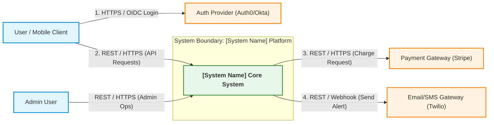
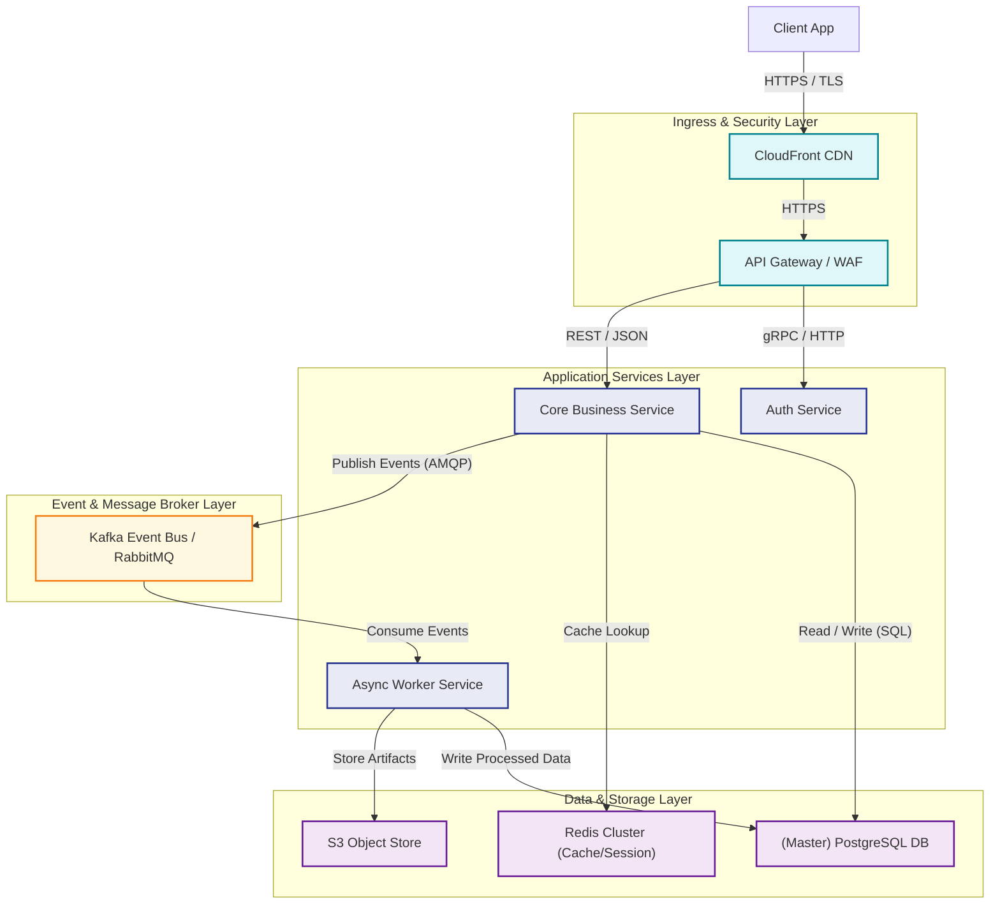

> **How to use this template**
> One-line *"Why it's critical"* notes explain each section's purpose — strip them before distribution.
>
> **Depth guide — what belongs in HLD vs. LLD:**
> HLD answers **"what is the system and how do its major pieces fit together"** — for architects, stakeholders, and any engineer about to start LLD work. It should be understandable by someone who doesn't read code.
> LLD (separate document) answers **"exactly how is each piece built"** — class/module design, schemas, API contracts, algorithms. If you find yourself writing a specific SQL column type, a function signature, or an exact error code here, **that belongs in the LLD** — move it.
> Rule of thumb: HLD should survive an implementation-language change; LLD should not.
>
> **Diagram Creation Standards for HLD:**
> - **Primary Tooling:** Embed raw `mermaid` code blocks directly within the markdown document for version-controlled rendering. Save exported high-resolution PNGs to `./evidence/` for presentation artifacts.
> - **Abstraction Level:** Focus on system boundaries, logical components/services, message buses, data stores, and communication protocols. Do NOT show internal classes, code methods, DB column lists, or API JSON bodies (save those for LLD).
> - **Layout & Direction:** Standardize on Top-to-Bottom (`graph TB`) for tiered multi-layer architectures or Left-to-Right (`graph LR`) for data processing pipelines.
> - **Arrow Annotations:** Every arrow MUST explicitly specify the communication protocol or transport mechanism (e.g., `|HTTPS / REST|`, `|gRPC|`, `|Kafka Event|`, `|TLS / TCP|`).
> - **Subgraphs & Grouping:** Use `subgraph` blocks to visually demarcate system boundaries, trust zones, cloud VPCs/regions, and third-party external boundaries.
> - **Mermaid Syntax Safeguards:** Quote node labels containing parentheses or brackets (`node["Component Name (REST)"]`) and avoid raw HTML tags inside labels.

---

# [System Name] — High-Level Design (HLD) Document

| Field | Value |
|---|---|
| Document ID | |
| Version | 1.0 |
| Status | Draft / In Review / Approved |
| Related LLD(s) | link to each component's LLD |
| Related ADRs | |
| Author(s) | |
| Approvers | |
| Date | |

---

## 1. Introduction & Purpose
*Why it's critical: orients every reader — this is often the only section a non-technical stakeholder reads.*

- **Purpose of this document:**
- **Intended audience:** architects, engineering leads, security/compliance reviewers, product stakeholders.
- **How to read this document:** point readers to LLD for implementation detail.

---

## 2. Business Context & Goals

| Item | Detail |
|---|---|
| Business problem being solved | |
| Success metrics | e.g., adoption %, latency target, cost ceiling |
| Stakeholders | |
| Related initiatives/dependencies | |

---

## 3. Scope

| In Scope | Out of Scope |
|---|---|
| | |

**Assumptions:**
**Constraints:** (technical, regulatory, timeline, budget, team size)

---

## 4. System Context
*Why it's critical: before drawing internals, the reader needs to see the system's boundary — what talks to it, and what it talks to. This is the single diagram that should never be skipped.*

- **Context diagram reference:** (`./evidence/system-context-diagram.png`) — shows this system as one box, with all external actors/systems around it.

### How to Create the System Context Diagram
1. Place **[System Name]** inside a central `subgraph` or highlighted node representing the primary system boundary.
2. Position external users/clients on the left or top (e.g., Mobile App, Web Browser, Admin Console).
3. Position external systems and third-party APIs (e.g., Auth Provider, Payment Gateway, Notification Service) on the right or bottom.
4. Draw directed arrows showing primary interactions, annotating every link with exact communication protocols (REST, WebSockets, gRPC, OAuth2).

**Mermaid Context Diagram Template:**


| External Entity | Type | Interaction |
|---|---|---|
| | User / External System / Third-party API | Inbound/Outbound, protocol |

---

## 5. High-Level Architecture
*Why it's critical: this is the primary artifact of the whole document — everything else supports or elaborates on this diagram.*

- **Architecture diagram reference:** (`./evidence/high-level-architecture.png`)
- **Architecture style:** Monolith / Microservices / Event-driven / Serverless / Hybrid — and why.

### How to Create the High-Level Architecture Diagram
1. Group components logically into `subgraph` layers: **Ingress / Security Layer**, **Application Services Layer**, **Messaging & Event Layer**, and **Data Storage Layer**.
2. Represent every microservice, API gateway, message broker, cache, and database as a distinct labeled node.
3. Label interaction arrows with protocols and synchronous vs. asynchronous nature (e.g., `REST (sync)`, `AMQP Message (async)`, `gRPC`, `SQL`).
4. Use consistent visual styling (`classDef`) across tiers so readers can distinguish services from storage and queues instantly.

**Mermaid Architecture Diagram Template:**


### 5.1 Major Components

| Component | Responsibility (one sentence) | Owning Team | LLD Reference |
|---|---|---|---|
| | | | link |

### 5.2 Component Interaction Overview

| From | To | Interaction Type | Sync/Async |
|---|---|---|---|
| | | REST/gRPC/Event/Queue | |

---

## 6. Data Architecture (High Level)
*Why it's critical: readers need to know what data exists and where it lives before caring about column-level schema — that detail is the LLD's job.*

- **High-level data flow diagram reference:** (`./evidence/data-flow-hld.png`)

### How to Create the High-Level Data Flow Diagram
1. Show data ingestion sources (Users, Webhooks, IoT Sensors, Batch Feeds) on the left.
2. Show data processing pipelines, transformation workers, and validation layers in the middle.
3. Show target persistence stores (OLTP DB, Data Lake, Cache, Analytics Warehouse) on the right.
4. Annotate connections with data formats (JSON, Protobuf, Avro, Parquet) and ingestion mechanisms.

**Mermaid Data Flow Diagram Template:**
```mermaid
graph LR
    classDef source fill:#e1f5fe,stroke:#0288d1,stroke-width:2px;
    classDef process fill:#fff3e0,stroke:#f57c00,stroke-width:2px;
    classDef store fill:#f3e5f5,stroke:#6a1b9a,stroke-width:2px;

    ClientData["Client Apps (Events)"]:::source
    ThirdPartyFeed["External Webhooks"]:::source

    subgraph IngestionPipeline ["Ingestion & Transformation Pipeline"]
        IngestAPI["Ingestion API"]:::process
        StreamProcessor["Stream Processor (Flink/Spark)"]:::process
        DLQ["Dead Letter Queue"]:::process
    end

    subgraph PersistenceStorage ["Data Storage Tier"]
        RawStore["Data Lake (S3 / Parquet)"]:::store
        OperationalDB["OLTP Database (Postgres)"]:::store
        AnalyticsDB["OLAP Analytics (Snowflake)"]:::store
    end

    ClientData -->|"JSON over HTTPS"| IngestAPI
    ThirdPartyFeed -->|"JSON Webhooks"| IngestAPI
    IngestAPI -->|"Avro / Event Stream"| StreamProcessor
    IngestAPI -.->"Failed Records"| DLQ
    StreamProcessor -->|"Structured Batches"| RawStore
    StreamProcessor -->|"State Updates"| OperationalDB
    RawStore -->|"ETL / CDC Synced"| AnalyticsDB
```

| Data Domain | Primary Store | Classification | Owning Component |
|---|---|---|---|
| e.g., User profile data | PostgreSQL | Confidential | User Service |

- **Data ownership model:** which component is system-of-record for which data domain.

---

## 7. Integration & Interfaces (High Level)

| Integration | Purpose | Protocol | Owned By |
|---|---|---|---|
| | | | Internal / [Vendor Name] |

*(Detailed request/response schemas belong in the LLD — this table just establishes what integrations exist and why.)*

---

## 8. Non-Functional Requirements

| NFR | Target | Approach (high level) |
|---|---|---|
| Availability | 99.9% | Multi-AZ deployment |
| Latency (p95) | < 200ms | Caching layer, CDN |
| Scalability | X → Y users over 12 months | Horizontal auto-scaling |
| Security | | link to Security Architecture Review |
| Disaster Recovery | RTO/RPO targets | |

---

## 9. Deployment Topology (High Level)

- **Diagram reference:** (`./evidence/deployment-topology.png`)

### How to Create the Deployment Topology Diagram
1. Draw cloud environments/regions as top-level `subgraph` boundaries (e.g., `AWS Region: us-east-1 (Primary)`).
2. Draw Availability Zones (AZ-A, AZ-B) and VPC Subnets (Public Subnet, Private App Subnet, Isolated DB Subnet) inside each region.
3. Place Load Balancers in Public Subnets, Application Pods/Instances in Private Subnets, and Database Primary/Standby instances in Isolated Subnets.
4. Show replication paths, failover mechanisms, and Route 53/DNS ingress paths.

**Mermaid Deployment Topology Diagram Template:**
```mermaid
graph TB
    subgraph RegionPrimary ["AWS Region: us-east-1 (Primary)"]
        subgraph PublicSubnet ["Public Subnet"]
            ALB["Application Load Balancer"]
        end

        subgraph AZa ["Availability Zone A"]
            subgraph AppSubnetA ["Private App Subnet A"]
                AppPodA1["App Container Pod 1"]
                AppPodA2["App Container Pod 2"]
            end
            subgraph DBSubnetA ["Isolated DB Subnet A"]
                DBPrimary["PostgreSQL (Primary Master)"]
            end
        end

        subgraph AZb ["Availability Zone B"]
            subgraph AppSubnetB ["Private App Subnet B"]
                AppPodB1["App Container Pod 3"]
            end
            subgraph DBSubnetB ["Isolated DB Subnet B"]
                DBStandby["PostgreSQL (Standby Sync)"]
            end
        end
    end

    InternetClient["Internet Clients"] -->|"DNS / Route 53"| ALB
    ALB -->|"Target Group Route"| AppPodA1
    ALB -->|"Target Group Route"| AppPodA2
    ALB -->|"Target Group Route"| AppPodB1

    AppPodA1 --> DBPrimary
    AppPodA2 --> DBPrimary
    AppPodB1 --> DBPrimary

    DBPrimary -.->"Synchronous Replication"| DBStandby
```

| Environment | Region(s) | High-Level Infra |
|---|---|---|
| Prod | | |
| Staging | | |

---

## 10. Technology Choices (High Level + Rationale)
*Why it's critical: readers evaluating the design want to know why, not just what — without rationale this section is just a shopping list.*

| Layer | Technology | Rationale (1–2 sentences) | ADR Reference |
|---|---|---|---|
| | | | |

---

## 11. Security & Compliance Overview
*Why it's critical: HLD readers (including auditors) need the posture summary here; the full control-by-control detail lives in the Security Architecture Review, not duplicated here.*

- **Data sensitivity handled:**
- **Key security controls (summary):**
- **Compliance frameworks applicable:**
- **Link to full Security Architecture Review:**

---

## 12. Risks, Assumptions & Open Issues

| Item | Type | Impact | Mitigation/Owner |
|---|---|---|---|
| | Risk/Assumption/Open Issue | | |

---

## 13. Alternatives Considered (High Level)

| Alternative Architecture | Why Rejected |
|---|---|
| | |

---

## 14. Appendix
- **A. Full-resolution diagrams**
- **B. Glossary**
- **C. Related documents:** LLDs (list), ADRs, Security Architecture Review, Solution Architecture Document
- **D. Sign-off:** Architect, Engineering Leads, Security, Product Owner

---

## Depth Self-Check Before Finalizing
*Run this checklist before calling the HLD done:*
- [ ] Could someone outside engineering understand section 1–5 without help?
- [ ] Does every component in section 5.1 have (or will have) its own LLD?
- [ ] Have you avoided writing actual API payloads, SQL DDL, or class names anywhere in this doc? (Those belong in LLD.)
- [ ] Would this document still be accurate if the implementation language/framework changed?
- [ ] Are all diagrams built using clean Mermaid syntax with clear system boundaries, subgraphs, and labeled protocol arrows?
- [ ] Are exported diagram image references present under `./evidence/` for high-resolution rendering?