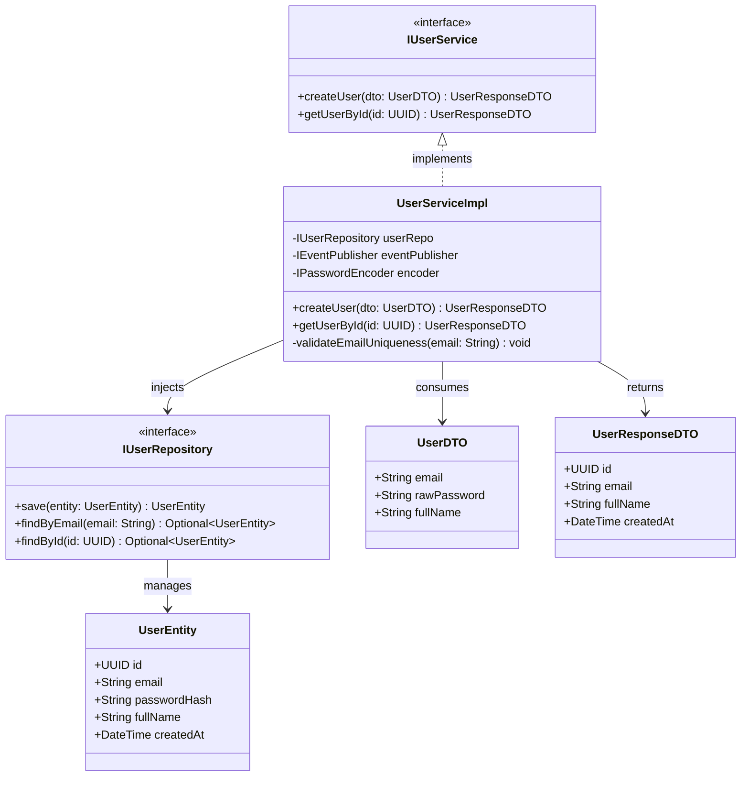
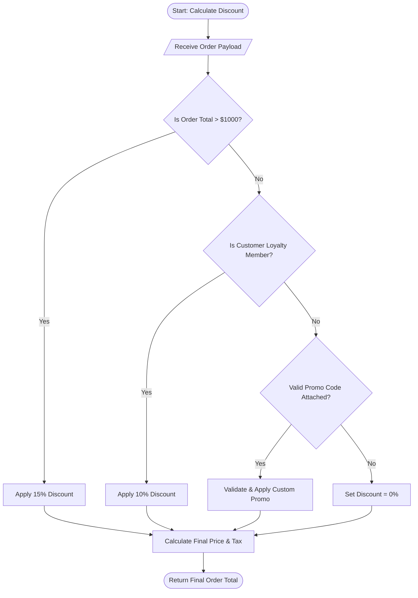
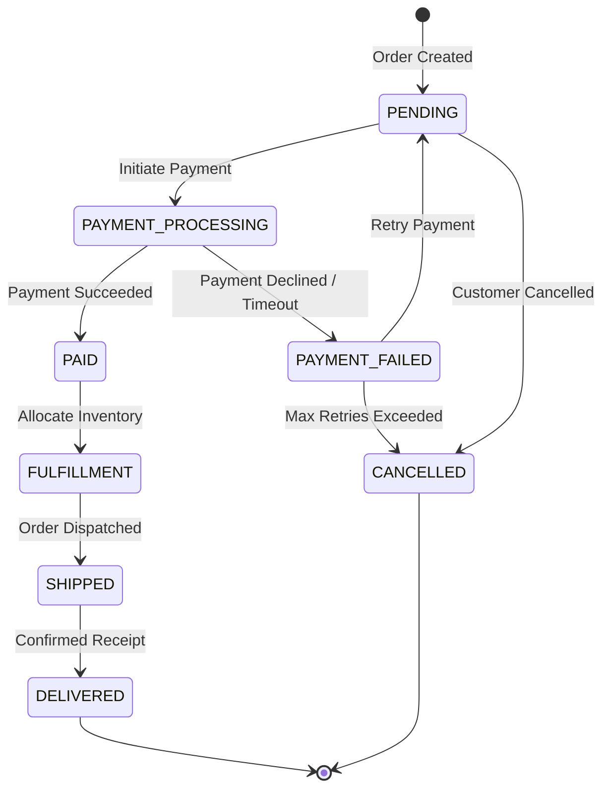

> **How to use this template**
> One-line *"Why it's critical"* notes explain each section's purpose — strip them before distribution.
>
> **Depth guide — what belongs in LLD vs. HLD:**
> LLD answers **"exactly how is this component built"** — the level of detail a developer needs to implement without having to ask the architect a follow-up question. This document is written **per component/service**, not once for the whole system — create one LLD per major component listed in the HLD's Section 5.1.
> If a reviewer can implement the component correctly using only this document (no verbal clarification needed), the LLD is deep enough. If they'd need to guess a data type, a status code, or a locking strategy, it isn't.
>
> **Diagram Creation Standards for LLD:**
> - **Primary Tooling:** Embed raw `mermaid` code blocks (`classDiagram`, `erDiagram`, `sequenceDiagram`, `flowchart TD`, `stateDiagram-v2`) directly in Markdown for version control. Also save exported high-resolution PNGs to `./evidence/`.
> - **Abstraction Level:** Low-level and implementation-specific. Include exact class names, field data types, method signatures, return types, foreign key relationships, request/response JSON fields, HTTP status codes, and precise execution flow.
> - **Sequence Diagrams:** MUST use explicit activation bars (`activate`/`deactivate`), numbered steps (`autonumber`), message payloads (e.g., `createUser(dto)`), and error branches (`alt / else`).
> - **ER Diagrams:** MUST specify explicit entities, attributes with types, primary keys (`PK`), foreign keys (`FK`), and cardinalities (`||--o{`, `||--||`, `}|--|{`).
> - **Class Diagrams:** MUST specify visibility modifiers (`+` public, `-` private, `#` protected), interface implementation (`<|..`), composition (`*--`), and dependency associations (`-->`).
> - **Mermaid Syntax Safeguards:** Keep node/entity names alphanumeric; use quotes for labels containing special characters or generic types (e.g., `Optional~UserEntity~`).

---

# [Component/Module Name] — Low-Level Design (LLD) Document

| Field | Value |
|---|---|
| Document ID | |
| Version | 1.0 |
| Status | Draft / In Review / Approved / Implemented |
| Parent HLD | link |
| Related ADRs | |
| Author(s) | |
| Reviewers | |
| Date | |

---

## 1. Component Overview
*Why it's critical: re-anchors the reader in this component's specific responsibility before diving into internals — prevents scope creep into neighboring components.*

- **Responsibility (from HLD):**
- **In scope for this LLD:**
- **Out of scope (owned by other components):**
- **Dependencies (upstream/downstream components):**

---

## 2. Module / Class Design
*Why it's critical: this is the actual blueprint a developer codes from — ambiguity here becomes inconsistent implementation across the team.*

- **Class/module diagram reference:** (`./evidence/class-diagram.png`)

### How to Create the Class / Module Diagram
1. Model every core class, interface, service, repository, and DTO within the component.
2. Use standard visibility markers (`+` public, `-` private, `#` protected).
3. Specify exact method parameters and return types (e.g., `+ createUser(dto: UserDTO): UserResponseDTO`).
4. Show relationships: Inheritance (`<|--`), Interface implementation (`<|..`), Composition (`*--`), and Injection/Dependency (`-->`).

**Mermaid Class Diagram Template:**


| Module/Class | Responsibility | Key Methods/Functions | Dependencies |
|---|---|---|---|
| `UserService` | | `createUser()`, `validateUser()` | `UserRepository` |

### 2.1 Method-Level Detail (for critical/complex logic only)

| Method | Signature | Preconditions | Postconditions | Exceptions Thrown |
|---|---|---|---|---|
| `createUser` | `createUser(dto: UserDTO): User` | Email not already registered | User persisted, event emitted | `DuplicateEmailException` |

---

## 3. Database Schema
*Why it's critical: schema decisions are expensive to change post-launch — this is the section most worth over-specifying up front.*

- **ER diagram reference:** (`./evidence/er-diagram.png`)

### How to Create the Entity-Relationship (ER) Diagram
1. Define entities for every database table in the component.
2. Specify column names, SQL data types (e.g., `UUID`, `VARCHAR(255)`, `TIMESTAMP`, `DECIMAL(10,2)`), PK markers, and FK markers.
3. Draw relationship connectors with exact cardinality notation:
   - `||--o{` : One-to-Zero-or-Many
   - `||--|{` : One-to-One-or-Many
   - `||--||` : Exactly One-to-One
   - `}|--|{` : Many-to-Many

**Mermaid ER Diagram Template:**

```mermaid
erDiagram
    USERS ||--o{ ORDERS : places
    USERS ||--|| USER_PROFILES : has
    ORDERS ||--|{ ORDER_ITEMS : contains
    PRODUCTS ||--o{ ORDER_ITEMS : included_in

    USERS {
        uuid id PK
        varchar_255 email UK "NOT NULL"
        varchar_255 password_hash "NOT NULL"
        varchar_50 status "DEFAULT 'ACTIVE'"
        timestamp created_at "NOT NULL"
        timestamp updated_at "NOT NULL"
    }

    USER_PROFILES {
        uuid id PK
        uuid user_id FK,UK "NOT NULL"
        varchar_100 first_name
        varchar_100 last_name
        varchar_20 phone_number
    }

    ORDERS {
        uuid id PK
        uuid user_id FK "NOT NULL"
        decimal_10_2 total_amount "NOT NULL"
        varchar_30 status "NOT NULL"
        timestamp created_at "NOT NULL"
    }

    ORDER_ITEMS {
        uuid id PK
        uuid order_id FK "NOT NULL"
        uuid product_id FK "NOT NULL"
        integer quantity "NOT NULL"
        decimal_10_2 unit_price "NOT NULL"
    }

    PRODUCTS {
        uuid id PK
        varchar_255 name "NOT NULL"
        varchar_100 sku UK "NOT NULL"
        decimal_10_2 price "NOT NULL"
        integer stock_quantity "NOT NULL"
    }
```


### 3.1 Tables

**Table: `users`**

| Column | Type | Constraints | Description |
|---|---|---|---|
| id | UUID | PK | |
| email | VARCHAR(255) | UNIQUE, NOT NULL | |
| created_at | TIMESTAMP | NOT NULL, DEFAULT now() | |

**Indexes:**

| Index Name | Columns | Type | Reason |
|---|---|---|---|
| idx_users_email | email | UNIQUE B-TREE | Fast lookup, enforce uniqueness |

**Foreign Keys / Relationships:**

| Table | Column | References | On Delete |
|---|---|---|---|
| orders | user_id | users.id | CASCADE / RESTRICT |

### 3.2 Data Migration Notes
- Migration strategy (if modifying existing schema): backward-compatible steps, rollback plan.

---

## 4. API Specification
*Why it's critical: this is the contract between this component and everything that calls it — inconsistency here breaks integrations silently.*

### `POST /api/v1/users`

| Field | Value |
|---|---|
| Description | |
| Auth Required | Bearer token, scope: `users:write` |
| Rate Limit | 100 req/min per client |

**Request Body:**
```json
{
  "email": "string, required, valid email format",
  "name": "string, required, max 100 chars"
}
```

**Response — 201 Created:**
```json
{
  "id": "uuid",
  "email": "string",
  "created_at": "ISO8601 timestamp"
}
```

**Error Responses:**

| Status | Code | Condition |
|---|---|---|
| 400 | `INVALID_INPUT` | Validation failure |
| 409 | `DUPLICATE_EMAIL` | Email already registered |
| 429 | `RATE_LIMITED` | Rate limit exceeded |

*(Repeat per endpoint. For large APIs, link to an OpenAPI/Swagger spec instead of duplicating here — but every endpoint must exist in one place or the other.)*

---

## 5. Sequence Diagrams
*Why it's critical: this is where race conditions, ordering bugs, and missing rollback logic get caught — before code, not after a production incident.*

- **Sequence diagram reference:** (`./evidence/sequence-diagram.png`)

### How to Create Detailed Sequence Diagrams
1. Declare all participants (Client, Gateway, Controller/Service, Repository, DB, External APIs, EventBus) using explicit `actor`, `participant`, or `database` keywords.
2. Enable `autonumber` for unambiguous step referencing.
3. Use `activate` and `deactivate` to show lifetime/execution focus on participants.
4. Include exact payload parameters in request calls and returned data or status codes in return arrows (`-->>`).
5. Use `alt / else` blocks to model validation failures, duplicate checks, and exception pathways.
6. Show asynchronous side effects (e.g. publishing event messages) with dashed arrows (`-->>` or `->>`).

**Mermaid Sequence Diagram Template:**
```mermaid
sequenceDiagram
    autonumber
    actor Client as Client App
    participant GW as API Gateway
    participant Svc as UserService
    participant Repo as UserRepository
    database DB as PostgreSQL DB
    participant Bus as EventBus / Kafka

    Client->>GW: POST /api/v1/users (UserDTO)
    activate GW
    GW->>Svc: createUser(dto)
    activate Svc
    
    Svc->>Repo: findByEmail(dto.email)
    activate Repo
    Repo->>DB: SELECT * FROM users WHERE email = ?
    activate DB
    DB-->>Repo: result (null or UserEntity)
    deactivate DB
    Repo-->>Svc: Optional.empty()
    deactivate Repo

    alt Email Already Exists
        Svc-->>GW: throw DuplicateEmailException
        GW-->>Client: 409 Conflict {"code": "DUPLICATE_EMAIL"}
    else Email Available
        Svc->>Svc: hashPassword(dto.rawPassword)
        Svc->>Repo: save(newUserEntity)
        activate Repo
        Repo->>DB: INSERT INTO users (...) VALUES (...)
        activate DB
        DB-->>Repo: UserEntity (with generated UUID)
        deactivate DB
        Repo-->>Svc: persistedUserEntity
        deactivate Repo

        Svc->>Bus: publish(UserCreatedEvent)
        Svc-->>GW: UserResponseDTO
        deactivate Svc
        GW-->>Client: 201 Created {"id": "uuid", "email": "..."}
        deactivate GW
    end
```

*(One sequence diagram per non-trivial use case/flow — especially anything involving multiple services, external calls, or a failure branch.)*

---

## 6. Business Logic / Algorithm Detail
*Why it's critical: for anything non-obvious (pricing calculation, matching algorithm, retry/backoff logic), pseudocode here prevents each developer from implementing a subtly different version.*

- **Logic flowchart reference:** (`./evidence/algorithm-flowchart.png`)

### How to Create Decision Flowcharts / Activity Diagrams
1. Use `flowchart TD` (Top-Down) or `flowchart LR` (Left-to-Right).
2. Start with a clear entry point `([Start])` and exit point `([End])`.
3. Use rectangle nodes `[Action / Calculation]` for processing steps.
4. Use diamond nodes `{"Condition Check?"}` for branching logic, labeling output paths explicitly (e.g., `|Yes|`, `|No|`, `|Timeout|`).
5. Use loopbacks or error nodes to model retries or error handling.

**Mermaid Business Logic Flowchart Template:**


```
function calculateDiscount(order):
    if order.total > 1000:
        discount = 0.15
    elif order.customer.isLoyaltyMember:
        discount = 0.10
    else:
        discount = 0
    return order.total * (1 - discount)
```

---

## 7. Error Handling (Detailed)

| Error Scenario | Detection Point | Handling Behavior | Logged? | Retryable? |
|---|---|---|---|---|
| Downstream service timeout | HTTP client | Retry 3x with exponential backoff, then circuit-break | Yes | Yes |
| Invalid input | Request validation layer | Return 400 with field-level errors | Yes (info level) | No |
| DB constraint violation | Repository layer | Map to domain exception, return 409 | Yes | No |

---

## 8. Configuration & Environment Variables

| Variable | Purpose | Default | Required |
|---|---|---|---|
| `DB_CONNECTION_STRING` | | — | Yes |
| `MAX_RETRY_ATTEMPTS` | | 3 | No |

---

## 9. Third-Party Dependencies

| Library | Version | Purpose | License |
|---|---|---|---|
| | | | |

---

## 10. Concurrency & Locking (if applicable)
*Why it's critical: skipped in most designs, and the direct cause of the hardest-to-reproduce production bugs (race conditions, double-writes).*

- **State diagram reference:** (`./evidence/state-diagram.png`)

### How to Create State Transition Diagrams
1. Use `stateDiagram-v2` for lifecycle states of mutable domain objects (Orders, Payments, Workflows, Jobs).
2. Define the start state `[*]` and terminal states `[*]`.
3. Label transition arrows with the triggering event or method call `--> State : Event / Condition`.
4. Use composite nested states `state Processing { ... }` if a state has sub-states.

**Mermaid State Diagram Template:**


| Shared Resource | Concurrency Risk | Locking Strategy |
|---|---|---|
| e.g., inventory count | Double-decrement on simultaneous orders | Optimistic locking with version column |

---

## 11. Caching Strategy (if applicable)

| Data Cached | Cache Layer | TTL | Invalidation Trigger |
|---|---|---|---|
| | Redis/In-memory/CDN | | On write / time-based |

---

## 12. Unit & Integration Test Plan
*Why it's critical: ties design directly to verification — a design element with no corresponding test case is a design element nobody confirmed actually works.*

| Test Case | Type | Input | Expected Result |
|---|---|---|---|
| Create user with valid data | Unit | Valid DTO | User created, 201 |
| Create user with duplicate email | Unit | Existing email | 409 DUPLICATE_EMAIL |
| Concurrent user creation, same email | Integration | Two simultaneous requests | Exactly one succeeds |

---

## 13. Performance Considerations

| Concern | Approach |
|---|---|
| Expected load | requests/sec, data volume |
| Query optimization | indexes used, avoid N+1 |
| Payload size limits | |

---

## 14. Security Implementation Detail
*Why it's critical: this is where "encryption required" from the HLD becomes an actual algorithm/library choice — vague security requirements produce inconsistent implementations.*

| Concern | Implementation Detail |
|---|---|
| Encryption at rest | AES-256, via [KMS/library] |
| Password hashing | bcrypt, cost factor 12 |
| Input sanitization | Parameterized queries, output encoding library |
| Secrets access | Fetched from [Vault/KMS] at runtime, never in env files committed to repo |

---

## 15. Deployment Detail

| Item | Detail |
|---|---|
| Build artifact | Docker image tag pattern |
| Deployment method | CI/CD pipeline reference |
| Health check endpoint | `/health` |
| Rollback procedure | |

---

## 16. Traceability Matrix
*Why it's critical: proves every requirement from the HLD/PRD actually has a corresponding design element and test — the single most common audit/QA request.*

| Requirement (from HLD/PRD) | Design Element | Test Case ID |
|---|---|---|
| | Section 4 endpoint / Section 2 class | TC-01 |

---

## 17. Appendix
- **A. Full OpenAPI/Swagger spec (link)**
- **B. Full ER diagram**
- **C. Related LLDs (for dependent components)**
- **D. Sign-off:** Tech Lead, Reviewer, Security (if handling sensitive data)

---

## Depth Self-Check Before Finalizing
*Run this checklist before calling the LLD done:*
- [ ] Could a developer unfamiliar with this component implement it correctly using only this document?
- [ ] Does every API endpoint have a full request/response schema and error table?
- [ ] Does every table have explicit types, constraints, and indexes (not just column names)?
- [ ] Are concurrency/locking risks addressed for any shared/mutable state?
- [ ] Does every HLD requirement trace to a design element and a test case (Section 16)?
- [ ] Are sequence diagrams, class diagrams, ER diagrams, activity flowcharts, and state machines fully detailed with explicit types, signatures, payloads, and clean Mermaid syntax?