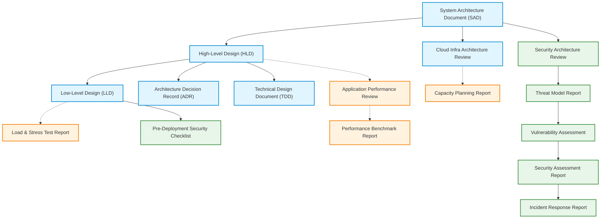

> **How to use this template**
> One-line *"Why it's critical"* notes explain each section's purpose — strip them before external distribution.
>
> **Master Architecture Documentation Map & Template Index:**
> This document serves as the master entry point and index for all engineering, performance, and security documentation templates in the platform repository.
> Use Section 0 below to navigate to specific high-level, low-level, performance, or security templates.

---

# [System Name] — Solution / System Architecture Document

| Field | Value |
|---|---|
| Document ID | |
| Classification | Internal |
| Version | 1.0 |
| Status | Draft / In Review / Approved |
| Author(s) | |
| Approvers | |
| Date | |

---

## 0. Master Architecture & Policy Template Index

### 0.1 Architecture Documentation Templates (`architectureDoc/`)
| Document Template | Purpose & Scope | Primary Audience | Template Link |
|---|---|---|---|
| **System Architecture Document** | Master solution architecture overview, logical layers, component breakdown, and template index. | Architects, Eng Leads, Executive Stakeholders | [system-architecture-document.md](./system-architecture-document.md) |
| **High-Level Design (HLD)** | System context, multi-tier architecture, component boundaries, deployment topology, and high-level data flows. | System Architects, Tech Leads, Security Reviewers | [high-level-design.md](./high-level-design.md) |
| **Low-Level Design (LLD)** | Deep component blueprints: class diagrams, database schemas (DDL/ERD), API specifications, sequence flows, pseudocode, and state machines. | Developers, Tech Leads, QA Engineers | [low-level-design.md](./low-level-design.md) |
| **Architecture Decision Record (ADR)** | Documents single architectural decisions, options considered, trade-offs, and rationale. | Architects, Developers | [architecture-decision-record.md](./architecture-decision-record.md) |
| **Cloud Infrastructure Architecture Review** | Evaluates cloud resources, networking, VPC subnets, IAM policies, cost estimation, and multi-region HA/DR posture. | Infrastructure / DevOps Leads, Cloud Architects | [cloud-infra-architecture-review.md](./cloud-infra-architecture-review.md) |
| **Technical Design Document (TDD)** | Focused technical blueprint for smaller features or specific subsystem enhancements. | Feature Lead Developers, Reviewers | [technical-design-document.md](./technical-design-document.md) |

### 0.2 Performance Documentation Templates (`performanceDoc/`)
| Document Template | Purpose & Scope | Primary Audience | Template Link |
|---|---|---|---|
| **Application Performance Review** | Analyzes application throughput, latency bottlenecks, memory usage, CPU profiles, and database query optimization. | Performance Engineers, Backend Leads | [application-performance-review.md](../performanceDoc/application-performance-review.md) |
| **Infrastructure Capacity Planning Report** | Forecasts compute, storage, memory, and bandwidth requirements based on user growth and throughput targets. | Site Reliability Engineers (SRE), FinOps, Infra Leads | [infrastructure-capacity-planning-report.md](../performanceDoc/infrastructure-capacity-planning-report.md) |
| **Load & Stress Test Report** | Documents test scripts, virtual user ramp-ups, breaking-point analysis, error rates, and system recovery curves. | QA Automation Leads, Performance Testers | [load-stress-test-report.md](../performanceDoc/load-stress-test-report.md) |
| **Performance Benchmark Report** | Establishes baseline metrics (p50, p95, p99 latencies, RPS) before and after major architectural upgrades. | Architects, SREs, Product Managers | [performance-benchmark-report.md](../performanceDoc/performance-benchmark-report.md) |

### 0.3 Security Documentation Templates (`securityDoc/`)
| Document Template | Purpose & Scope | Primary Audience | Template Link |
|---|---|---|---|
| **Security Architecture Review** | Comprehensive security posture evaluation, compliance mapping (SOC2, ISO27001, GDPR), data encryption, and access controls. | Security Architects, CISO, Compliance Auditors | [security-architecture-review.md](../securityDoc/security-architecture-review.md) |
| **Threat Model Report** | STRIDE threat analysis, trust boundaries, attack vectors, data flow risks, and mitigation controls. | Security Engineers, System Architects | [threat-model-report.md](../securityDoc/threat-model-report.md) |
| **Vulnerability Assessment Report** | Results from SAST, DAST, dependency scanning (Snyk/Trivy), and automated security scanners. | SecOps, Developers | [vulnerability-assessment-report.md](../securityDoc/vulnerability-assessment-report.md) |
| **Security Assessment Report** | Independent or third-party penetration test findings, vulnerability severity ratings (CVSS), and remediation timelines. | CISO, Security Leads, Auditors | [security-assessment-report.md](../securityDoc/security-assessment-report.md) |
| **Incident Response Report** | Post-mortem analysis of security incidents, root causes, impact assessment, timeline, and corrective action items. | Incident Responders, Security Leads, Management | [incident-response-report.md](../securityDoc/incident-response-report.md) |
| **Pre-Deployment Security Checklist** | Mandatory production readiness check covering secrets, TLS, CORS, headers, auth controls, and logging. | Release Managers, DevOps, SecOps | [pre-deployment-security-checklist.md](../securityDoc/pre-deployment-security-checklist.md) |
| **Acceptable Use Policy** | Governance guidelines defining acceptable usage of infrastructure, endpoints, secrets, and data assets. | All Employees, Contractors, System Users | [acceptable-use-policy.md](../securityDoc/acceptable-use-policy.md) |
| **Response Playbook** | Step-by-step emergency playbooks for responding to specific incident vectors (DDoS, credential leak, ransomware, data breach). | Incident Response Team, SOC Analysts | [response-playbook.md](../securityDoc/response-playbook.md) |
| **Security & Engineering RACI Escalation Matrix** | Defines Responsible, Accountable, Consulted, and Informed roles across security events and operational escalations. | Engineering Managers, Security Leads, Support | [security-and-engineering-raci-escalation-matrix.md](../securityDoc/security-and-engineering-raci-escalation-matrix.md) |
| **Security Program Metrics & KPI Dashboard** | Tracks security posture KPIs (MTTR, patch SLA compliance, vulnerability burndown, training completion). | Executive Management, CISO | [security-program-metrics-and-kpi-dashboard.md](../securityDoc/security-program-metrics-and-kpi-dashboard.md) |

---

## 1. Executive Summary
*Why it's critical: stakeholders outside engineering (product, finance, compliance) need to understand what's being built and why in one paragraph.*

- **Purpose:** what business problem this architecture solves.
- **Key architectural decisions (1-line each):**
- **Estimated cost/timeline impact:**

---

## 2. Business Context & Requirements

| Requirement | Type | Priority | Source |
|---|---|---|---|
| | Functional / Non-Functional | Must/Should/Could | Stakeholder/PRD ref |

**Non-Functional Requirements (NFRs) — quantified targets:**

| NFR | Target | Measurement Method |
|---|---|---|
| Availability | 99.9% | Uptime monitoring |
| Latency (p95) | < 200ms | APM |
| Throughput | X req/sec | Load test |
| RTO / RPO | | |
| Scalability | X users/records by [date] | |

---

## 3. Architecture Principles & Constraints
*Why it's critical: makes implicit trade-offs explicit so future decisions can be checked against a consistent rationale instead of re-litigated each time.*

| Principle | Rationale |
|---|---|
| e.g., "Prefer managed services over self-hosted" | Reduce ops burden, small team |

| Constraint | Type | Impact |
|---|---|---|
| e.g., Must run in EU region | Regulatory | Limits cloud provider region choice |

---

## 4. Logical Architecture
*Why it's critical: this is the primary diagram most readers will reference — it needs to stand alone without the prose.*

- **Diagram reference:** (`./evidence/logical-architecture.png`)

| Layer | Components | Responsibility |
|---|---|---|
| Presentation | | |
| Application/Service | | |
| Data | | |
| Integration | | |

---

## 5. Component Breakdown

| Component | Responsibility | Technology | Owner Team | Scaling Model |
|---|---|---|---|---|
| | | | | Horizontal/Vertical |

---

## 6. Data Architecture

| Data Store | Type | Data Classification | Retention Policy | Backup Strategy |
|---|---|---|---|---|
| | SQL/NoSQL/Object Store | | | |

- **Data flow diagram reference:** (`./evidence/data-flow.png`)
- **Data ownership/lineage notes:**

---

## 7. Integration Architecture

| Integration | Direction | Protocol | Sync/Async | Failure Handling |
|---|---|---|---|---|
| | Inbound/Outbound | REST/gRPC/Event | | Retry/DLQ/Circuit breaker |

---

## 8. Technology Stack

| Layer | Technology | Version | Justification |
|---|---|---|---|
| | | | |

---

## 9. Deployment Architecture

| Environment | Infrastructure | Deployment Method | Rollback Strategy |
|---|---|---|---|
| Prod | | CI/CD pipeline | Blue-green / Canary |

- **Diagram reference:** (`./evidence/deployment-diagram.png`)

---

## 10. Cross-Cutting Concerns
*Why it's critical: these are the concerns most often forgotten until an incident forces them in — better to design for them up front.*

| Concern | Approach |
|---|---|
| Security | link to Security Architecture Review |
| Observability | logging/metrics/tracing stack |
| Disaster Recovery | |
| Cost Management | |

---

## 11. Risks & Trade-offs

| Decision | Alternative Considered | Trade-off Accepted | Risk |
|---|---|---|---|
| | | | |

---

## 12. Appendix
- **A. Full diagrams**
- **B. Related ADRs**
- **C. Glossary**
- **D. Sign-off:** Architect, Eng Lead, Product Owner